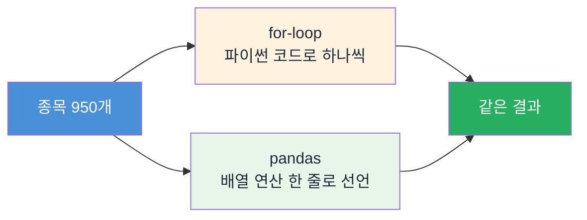

## 🚀 왜 pandas인가

> [!info] 학습 목표
>
> - pandas가 어디서, 왜 태어난 도구인지 세 문장으로 설명한다
> - 엑셀과 for-loop이 각각 어디서 막히는지 체감한다
> - for-loop과 pandas의 차이가 속도가 아니라 처리 방식 자체라는 것을 안다
> - 오늘 배울 여섯 노트가 어떻게 이어지는지 로드맵으로 확인한다

---

#### §1 📖 pandas는 어디서 왔나

**pandas 문법을 배우는 게 아니라, 단위가 다른 주식을 하나의 자로 재는 법을 배운다.** 삼성전자와 NAVER는 가격대가 다르고 종목 수는 950개가 넘는다 — 오늘 하루는 이 표들을 한 손에 쥐는 도구를 익히는 시간이다.

pandas는 강의실에서 태어난 도구가 아니다. 2008년 월스트리트의 헤지펀드 AQR Capital에서 Wes McKinney가 엑셀로 금융 데이터를 다루다 한계에 부딪혔고, 파이썬으로 표를 다루는 도구를 직접 만들었다. 이름은 경제학의 **panel data**(개체를 시간에 걸쳐 반복 관측한 데이터)에서 왔다.

우리가 오늘 배우는 것은 금융 데이터를 다루려고 태어난 도구다.

---

#### §2 😵 엑셀이 멈추는 자리

투자 리서치팀에서 급하게 메시지가 온다.

> "KOSPI 전체 종목 중 시가총액 상위 10개를 지금 뽑아줄 수 있어요?"

KOSPI에는 종목이 950개 넘게 있다. 엑셀을 연다. 다운로드한 파일을 스크롤한다. 정렬 버튼을 누른다. 상위 10개를 손으로 옮겨 적는다. 내일 다시 요청이 오면 처음부터 반복한다.

이 막막함은 파이썬을 몰라도 전원이 안다 — 엑셀로 수백 개 행을 다뤄본 사람이면 누구나 겪은 자리다.

| | 엑셀 수작업 | 코드 한 줄 |
|---|---|---|
| 950개 종목 정렬 | 다운로드 → 스크롤 → 정렬 버튼 | `df.sort_values('Marcap')` |
| 다음 날 다시 요청 | 처음부터 반복 | 같은 코드 재실행 |
| 조건 바뀜(상위 10 → 상위 20) | 손으로 다시 자름 | 숫자 하나만 수정 |

표를 눈으로 보며 손으로 옮기는 대신, 표에게 말로 시키는 도구가 필요하다.

---

#### §3 🔁 for-loop으로는 왜 어려운가

파이썬을 조금 아는 사람은 "그럼 for-loop을 돌리면 되지 않나"라고 생각할 수 있다. 맞는 생각이다 — 되긴 된다. 다만 950개를 하나씩 검사하고, 정렬하고, 상위 10개를 골라내는 코드는 금세 길어진다.

> [!tip]- for-loop 코드로 확인하기 (반복문이 낯설면 건너뛰어도 된다)
> ```python
> # for-loop으로 수익률 계산 (종가 5개)
> buy_price = 50000
> prices = [50000, 55000, 60000, 58000, 62000]
>
> for price in prices:
>     rate = (price - buy_price) / buy_price
>     print(f"종가 {price:,}원 → 수익률 {rate:.1%}")
>
> # 예상 출력:
> # 종가 50,000원 → 수익률 0.0%
> # 종가 55,000원 → 수익률 10.0%
> # 종가 60,000원 → 수익률 20.0%
> # 종가 58,000원 → 수익률 16.0%
> # 종가 62,000원 → 수익률 24.0%
> ```
> 5개는 이렇게 풀린다. 그런데 950개라면? 하나씩 도는 구조 자체는 그대로다 — 종목 수가 늘수록 사람이 지켜봐야 할 코드만 길어진다.

for-loop이 틀린 게 아니다. 다만 for-loop은 "하나씩 꺼내서" 계산한다 — 파이썬 코드가 원소 개수만큼 직접 반복을 돈다. pandas는 "배열 전체에 연산을 선언"한다 — `(price - buy_price) / buy_price`를 표 전체에 한 번 쓰면, 파이썬 반복문 없이 값마다 같은 계산이 적용된다. 여러 종목이 동시에 계산되는 게 아니라, 반복을 파이썬 코드로 쓰지 않아도 된다는 뜻이다.



핵심은 속도가 아니다. **pandas는 더 빠른 for-loop이 아니라, 반복을 코드로 쓰지 않고 배열 전체에 계산을 선언하는 방식이다.**

---

#### §4 🔓 오늘 해독할 세 줄

아래 세 줄을 오늘 하루 동안 한 단어씩 풀어본다.

```python
# 지금은 실행하지 않는다 — 오늘 끝에 한 단어씩 풀어본다
import FinanceDataReader as fdr
df = fdr.DataReader('005930', '2026-01-02', '2026-06-30')
df['Close'].pct_change()
```

지금 이 세 줄은 암호처럼 보여도 된다. `fdr`이 뭔지, `DataReader`가 뭘 돌려주는지, `pct_change()`가 뭘 계산하는지 — 지금 이해하라고 보여주는 코드가 아니다. 오늘 배우는 순서를 따라가면 마지막 노트에서 이 세 줄을 그대로 다시 만나고, 그때는 한 단어도 낯설지 않다.


110에서 저 `import` 한 줄과 `DataReader`를 직접 배운다. 200과 300에서 `df`라는 표가 어떻게 만들어지는지 배운다. 400에서 표의 특정 부분을 꺼내는 법을 배운다. 그리고 600에서 저 세 줄을 다시 만나 완전히 해독하고, 그 다음 단계까지 — 가격을 수익률로 바꾸는 것까지 간다.

---

#### §5 💼 어디에 쓰나

증권사·자산운용사 신입이 첫 달에 가장 많이 하는 일이 정확히 이것이다. 데이터를 받아서 표로 정리하는 일이다. Copilot 같은 AI에게 코드를 시키더라도 마찬가지다 — `df`가 뭔지, `Series`가 뭔지, `loc`이 뭘 하는지 모르면 AI가 내놓은 코드가 맞는 코드인지 판단할 수 없다. 자세한 이야기는 오늘 마지막 노트에서 다시 한다.

---

> [!summary] 🏆 이 노트를 마쳤다면?
>
> - [ ] pandas가 2008년 금융 현장의 엑셀 한계에서 태어났다는 것을 설명할 수 있다
> - [ ] for-loop과 pandas의 차이가 속도가 아니라 "하나씩"과 "통째로"의 차이라는 것을 설명할 수 있다
> - [ ] 엑셀 수작업과 코드 한 줄의 차이를 구분할 수 있다
> - [ ] 실습에서: 오늘 여섯 노트를 거쳐 위 세 줄을 직접 실행하고 그 결과를 확인한다
