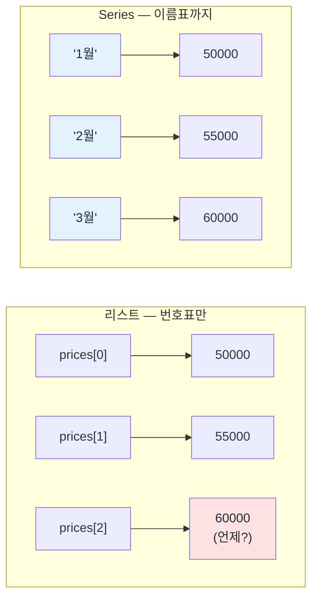

## Series — 인덱스가 붙은 1차원

> [!info] 학습 목표
>
> - 리스트와 Series의 차이를 인덱스 유무로 설명한다.
> - 리스트와 딕셔너리, 두 가지 방법으로 Series를 만든다.
> - for-loop 없이 벡터 연산으로 전체 계산을 한 줄에 처리한다.

---

## §1 리스트로는 부족하다

다음 리스트를 본다.

```python
prices = [50000, 55000, 60000, 58000, 62000]
print(prices[2])
```

```text
60000
```

`prices[2]`는 정확히 60000을 돌려준다. 그런데 이 60000이 언제 데이터인가? 1월인지 3월인지, 리스트는 답하지 않는다. 인덱스 번호는 값이 몇 번째에 있는지만 말해줄 뿐 언제·무엇인지는 말해주지 않는다.

숫자 하나를 꺼낼 때마다 "이게 몇 번째였더라"를 따로 기억해야 한다면, 데이터가 다섯 개일 때는 버텨도 950개가 되면 못 버틴다. 값 옆에 이름표가 필요하다.

#### 🔀 번호표만 있는 것과 이름표가 붙은 것



리스트는 왼쪽처럼 번호로만 값을 찾는다. Series는 오른쪽처럼 번호 대신(또는 번호와 함께) 이름표를 값에 붙인다. 이 이름표를 **인덱스**라고 부른다. Series는 인덱스가 붙은 1차원 자료구조다.

---

## §2 Series 만들기 두 가지

Series를 만드는 길은 두 가지다. 무엇을 갖고 있느냐에 따라 고르면 된다.

**리스트에서 만들기.** 아무 인덱스도 지정하지 않으면 리스트처럼 0부터 자동으로 번호가 붙는다.

```python
import pandas as pd

s = pd.Series(prices)
print(s)
```

```text
0    50000
1    55000
2    60000
3    58000
4    62000
dtype: int64
```

이건 리스트와 다를 게 없다. `index=`를 직접 주면 그제서야 이름표가 생긴다.

```python
s = pd.Series(prices, index=['1월', '2월', '3월', '4월', '5월'])
print(s['3월'])
```

```text
60000
```

이제 `s['3월']`로 "3월 값"을 바로 물어볼 수 있다. 번호가 아니라 이름으로 찾는다.

**딕셔너리에서 만들기.** 딕셔너리는 키-값 쌍이라, 키가 그대로 인덱스가 된다.

```python
prices_dict = {'005930': 50000, '035420': 380000, '000660': 150000}
s2 = pd.Series(prices_dict)
print(s2)
```

```text
005930     50000
035420    380000
000660    150000
dtype: int64
```

종목코드를 인덱스로 쓰는 이 형태가 실전에서 훨씬 자주 보인다 — 종목 하나하나가 항목이고, 각 항목의 값이 종가다.

두 방법이 만든 결과는 같은 종류의 물건이다. 차이는 데이터를 보는 관점이다. 리스트+`index=`는 순서대로 나열된 값에 이름표를 나중에 붙이는 쪽이고, 딕셔너리는 애초에 항목 하나하나가 이름표를 달고 태어난 쪽이다. 둘 다 결국 인덱스가 붙은 1차원 데이터로 수렴한다.

이 절의 코드는 그대로 실습(`FD-02-700`)에서 직접 짜본다.

---

## §3 벡터 연산 — for-loop이 한 줄이 된다

Series는 인덱스만 주는 게 아니다. 연산도 한꺼번에 처리한다.

```python
s = pd.Series(prices, index=['1월', '2월', '3월', '4월', '5월'])

# 전체 값에 10% 상승 시나리오를 한 번에 적용
print(s * 1.1)
```

```text
1월    55000.0
2월    60500.0
3월    66000.0
4월    63800.0
5월    68200.0
dtype: float64
```

`s * 1.1` 한 줄이 다섯 개 값 전부에 10%를 곱한다. 수익률도 마찬가지다.

```python
buy_price = 50000  # 1월에 매수했다고 가정

# 매수가 대비 수익률 전체를 한 줄로
print((s - buy_price) / buy_price)
```

```text
1월    0.00
2월    0.10
3월    0.20
4월    0.16
5월    0.24
dtype: float64
```

이 자리가 [[FD-02-100__wow-hook|100]]에서 접어 두었던 5줄짜리 for-loop이 돌아오는 자리다. 하나씩 꺼내서 계산하고 다시 넣던 그 5줄이 여기서는 `(s - buy_price) / buy_price` 한 줄이다. 그리고 이 한 줄은 원소가 5개든 950개든 그대로 쓸 수 있다. 데이터가 늘어나도 코드는 늘어나지 않는다 — 원소마다 계산이 이루어지는 것은 for-loop과 같지만, 그 반복을 파이썬 코드로 쓰지 않아도 된다는 것이 [[FD-02-100__wow-hook|100]]이 말한 "배열 연산으로 선언한다"의 실체다.

#### 📊 자주 쓰는 요약 메서드

| 메서드            | 하는 일                       | `s` 기준 결과                                                                                    |
| -------------- | -------------------------- | -------------------------------------------------------------------------------------------- |
| `s.max()`      | 최댓값 하나                     | `62000`                                                                                      |
| `s.mean()`     | 평균 하나                      | `57000.0`                                                                                    |
| `s.describe()` | 개수·평균·표준편차·최소/최대·분위수를 한 번에 | `count 5.0` / `mean 57000.0` / `std 4690.42` / `min 50000.0` / `50% 58000.0` / `max 62000.0` |

`max()`와 `mean()`은 숫자 하나를 돌려주고, `describe()`는 그 숫자들을 표 하나로 묶어 돌려준다. 데이터를 처음 받았을 때 전체 감을 잡는 용도로는 `describe()` 하나면 충분하다.

> [!tip] 더 보기
> Series를 만드는 다른 방법과 연산 목록은 [pandas 10분 소개](https://pandas.pydata.org/docs/user_guide/10min.html)에 정리되어 있다.

---

## §4 확인 문제

> [!tip] 💬 스스로 확인해 보세요
> 1. `prices = [10000, 20000, 30000]`에서 `prices[1]`을 인덱스만 보고 "언제" 데이터인지 알 수 없는 이유를 한 문장으로 설명해 보자.
> 2. 딕셔너리 `{'005930': 50000, '035420': 380000}`로 Series를 만들면 인덱스는 무엇이 되는가?

---

## 🔖 핵심 요약

> [!summary] 🏆 이 노트를 마쳤다면?
>
> - [ ] 리스트와 Series의 차이를 인덱스 유무로 설명할 수 있다.
> - [ ] 리스트에서, 그리고 딕셔너리에서 각각 Series를 만들 수 있다.
> - [ ] `s * 1.1`, `(s - buy_price) / buy_price` 같은 벡터 연산이 for-loop 없이 전체 원소에 한 번에 적용된다는 것을 설명할 수 있다.
> - [ ] 실습에서: `FD-02-700`에서 리스트/딕셔너리로 Series를 직접 만들고 벡터 연산을 실행해 확인한다.
