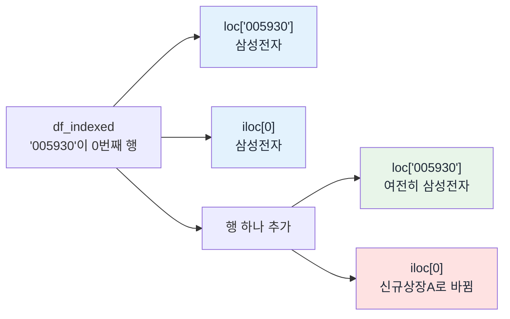
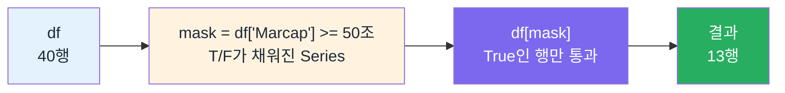

## 원하는 행 꺼내기 — 이름으로, 번호로, 조건으로

> [!info] 학습 목표
>
> - `.loc[]`(이름)과 `.iloc[]`(번호)를 구분해 쓰고, 둘이 언제 같고 언제 달라지는지 설명한다.
> - 범위를 자를 때 `loc`은 끝을 포함하고 `iloc`은 끝을 포함하지 않는다는 것을 안다.
> - Boolean 마스크로 조건에 맞는 행만 걸러낸다.
> - `&`/`|` 복합 조건에 괄호가 왜 필수인지 설명한다.

---

## §1 이름으로 꺼내기 vs 번호로 꺼내기

[[FD-02-300__dataframe|300]]에서 만든 KOSPI 표에서 삼성전자 행만 보고 싶다. 그리고 다른 질문도 있다 — 상위 3행만 보고 싶다. 둘 다 "행 하나를 꺼낸다"는 동작이지만 기준이 다르다. 앞의 질문은 이름을 알고 찾는 것이고, 뒤의 질문은 순서를 알고 찾는 것이다.

pandas는 이 둘을 별개의 도구로 나눠 둔다. 니모닉이 있다.

> **L**oc = **L**abel(이름표), **i**loc = **i**nteger(정수 위치)

엑셀로 치면 `loc`은 이름으로 검색하는 것이고, `iloc`은 "몇 번째 행"을 세어 클릭하는 것이다.

`Code`를 인덱스로 세운 표에서 둘을 나란히 써 본다. 지금은 삼성전자가 표의 첫 행이라 두 결과가 같다.

```python
# Code를 인덱스로 세운다 — 이제 '005930'이 라벨이다
df_indexed = df.set_index('Code')

print(df_indexed.loc['005930', 'Name'])   # 이름으로: '005930' 행
print(df_indexed.iloc[0]['Name'])         # 번호로: 0번째 행

# 예상 출력:
# 삼성전자
# 삼성전자
```

같은 답이라고 같은 도구는 아니다. 맨 위에 새 종목을 하나 추가하면 무슨 일이 벌어지는지 본다.

```python
new_row = pd.DataFrame(
    [{"Name": "신규상장A", "Market": "KOSPI", "Sector": "IT서비스", "Marcap": 5_000_000_000_000}],
    index=["999999"],
)
df_indexed2 = pd.concat([new_row, df_indexed])

print(df_indexed2.loc['005930', 'Name'])   # 이름은 그대로 삼성전자를 찾는다
print(df_indexed2.iloc[0]['Name'])         # 번호는 이제 0번째가 다른 행이다

# 예상 출력:
# 삼성전자
# 신규상장A
```

`loc['005930']`은 표에 무엇이 추가되든 항상 같은 답을 준다 — '005930'이라는 이름표를 찾을 뿐이다. `iloc[0]`은 표의 물리적 순서를 세므로, 순서가 바뀌면 답도 바뀐다. 니모닉만 외우고 넘어가면 이 차이가 안 남는다. 행이 추가되는 순간을 직접 봐야 남는다.



## §2 범위를 자를 때 끝이 포함되나

행 하나가 아니라 범위를 자를 때는 규칙이 하나 더 붙는다. `loc`은 시작과 끝 라벨을 **둘 다 포함**한다. `iloc`은 파이썬 슬라이싱과 똑같이 끝을 **포함하지 않는다**.

```python
print(df_indexed.loc['005930':'005935'][['Name']])
# 예상 출력:
#          Name
# Code
# 005930   삼성전자
# 000660  SK하이닉스
# 005935   삼성전자우

print(df_indexed.iloc[0:2][['Name']])
# 예상 출력:
#          Name
# Code
# 005930   삼성전자
# 000660  SK하이닉스
```

같은 자리를 가리켰는데 결과 행 수가 다르다. `loc['005930':'005935']`는 '005935'까지 포함해 3행을 주고, `iloc[0:2]`는 리스트 슬라이싱 규칙 그대로 2번 위치를 자른다.

> [!tip]- 이 규칙이 낯설면 — 파이썬 슬라이싱
> - `[0:2]`는 파이썬 리스트에서도 `[0]`, `[1]`만 주고 `[2]`는 안 준다.
> - `iloc`은 이 리스트 규칙을 그대로 물려받는다.
> - `loc`은 리스트가 아니라 "이름표가 붙은 구간"을 자르는 것이라 양 끝을 다 포함한다 — 규칙 자체가 다른 것이지 어느 한쪽이 틀린 게 아니다.

`.ix[]`라는 것도 옛 코드에서 보일 수 있다. `loc`과 `iloc`을 섞어 쓰는 방식이었는데, 혼동이 잦아 pandas 0.20에서 사용 중단(deprecated) 예고된 뒤 pandas 1.0(2020년)에서 완전히 제거됐다. 지금 배울 필요도, 쓸 이유도 없다.

**실습에서**: `FD-02-800__dataframe-explore`에서 이 슬라이싱을 직접 잘라 본다.

## §3 조건으로 꺼내기 — Boolean 마스크

이름도 순서도 아니고, 조건으로 행을 고르고 싶을 때가 더 많다. "이 표에서 시가총액 50조 이상인 종목만 보고 싶다"가 그런 질문이다. for-loop으로 40개 행을 하나씩 검사하면 되긴 하지만, [[FD-02-200__series|200]]에서 본 것처럼 pandas는 이걸 통째로 처리한다.

조건식을 컬럼에 직접 걸면 무슨 일이 벌어지는지 먼저 본다.

```python
mask = df['Marcap'] >= 50_000_000_000_000   # 50조 원
print(mask.head())

# 예상 출력:
# 0     True   (삼성전자)
# 1     True   (SK하이닉스)
# 2     True   (삼성전자우)
# 3     True   (SK스퀘어)
# 4     True   (삼성전기)
# Name: Marcap, dtype: bool
```

`df['Marcap'] >= 50_000_000_000_000`은 값 하나가 아니라 행마다 True/False가 채워진 Series다. 이 마스크를 표에 그대로 씌우면 True인 행만 남는다.

```python
print(mask.sum())      # True인 행 개수
print(df[mask][['Name', 'Marcap']])

# 예상 출력:
# 13
#          Name           Marcap
#         삼성전자 1464492791304000
#        SK하이닉스 1178284184745000
#         삼성전자우  148839858156500
#         SK스퀘어  129549366036000
#          삼성전기  104571174400000
#      LG에너지솔루션   81315000000000
#           현대차   77398435548000
#      삼성바이오로직스   69482717451000
#          삼성물산   60488507713000
#          KB금융   59977695819400
#          삼성생명   58800000000000
#     한화에어로스페이스   52852486025000
#          신한지주   51874251409500
```

40개 종목 중 13개가 걸러졌다. 마스크를 변수로 따로 꺼내 본 다음에는 한 줄로 줄여 쓰는 게 관용 표현이다.

```python
result = df[df['Marcap'] >= 50_000_000_000_000]
```

순서를 뒤집어 이 한 줄부터 보여주면, 대괄호 안에서 무슨 일이 일어나는지 안 보인다. `mask` 변수를 먼저 눈으로 본 다음에 줄여야 대괄호 안의 것이 "True/False로 가득 찬 표"라는 게 남는다.



## §4 조건 두 개 — 괄호가 없으면 터진다

조건을 두 개 걸고 싶을 때가 있다. "시가총액 50조 이상 **그리고** 150조 이하"처럼. 파이썬을 배울 때 `and`/`or`를 썼다면 이렇게 쓰고 싶어진다.

```python
# ❌ 괄호 없이 & 를 쓴 경우
df[df['Marcap'] >= 50_000_000_000_000 & df['Marcap'] <= 150_000_000_000_000]
```

이 줄은 에러가 난다.

```text
ValueError: The truth value of a Series is ambiguous.
Use a.empty, a.bool(), a.item() or a.all().
```

여기서 함정이 하나 있다. `and`/`or`를 써 본 학생일수록 이 코드를 자연스럽게 쓰고, 그래서 더 자주 걸린다. `&`/`|`는 `and`/`or`와 이름만 비슷할 뿐 연산자 우선순위가 다르다 — `&`가 비교 연산자(`>=`, `<=`)보다 먼저 계산되기 때문에, 파이썬은 이 줄을 우리가 의도한 것과 다른 순서로 묶어 버린다. 조건마다 괄호를 씌우면 우선순위 문제가 사라진다.

```python
# ✅ 조건마다 괄호로 묶는다
result = df[(df['Marcap'] >= 50_000_000_000_000) & (df['Marcap'] <= 150_000_000_000_000)]
print(len(result))
print(result[['Name', 'Marcap']])

# 예상 출력:
# 11
#          Name          Marcap
#         삼성전자우 148839858156500
#         SK스퀘어 129549366036000
#          삼성전기 104571174400000
#      LG에너지솔루션  81315000000000
#           현대차  77398435548000
#      삼성바이오로직스  69482717451000
#          삼성물산  60488507713000
#          KB금융  59977695819400
#          삼성생명  58800000000000
#     한화에어로스페이스  52852486025000
#          신한지주  51874251409500
```

50조 이상 조건 하나만 걸었을 때는 13행이었는데, 150조 이하를 더하니 11행으로 좁혀졌다 — 삼성전자와 SK하이닉스가 상한선에 걸려 빠졌다. `&`는 AND(둘 다 참), `|`는 OR(하나라도 참)이고, 둘 다 조건마다 괄호가 필요하다는 규칙은 같다.

> [!warning] 괄호 유무가 결과를 가른다
> - 틀린 예: `df[df['Marcap'] >= 50조 & df['Marcap'] <= 150조]` → `ValueError: The truth value of a Series is ambiguous.`
> - 맞는 예: `df[(df['Marcap'] >= 50조) & (df['Marcap'] <= 150조)]` → 11행
> - `&`/`|`는 `>=`/`<=` 같은 비교 연산자보다 연산자 우선순위가 높아서, 괄호 없이 쓰면 파이썬이 조건을 우리가 의도한 것과 다르게 묶는다.
> - `and`/`or`를 아는 학생이 오히려 여기서 더 자주 틀린다 — 아는 것이 방해가 되는 드문 경우다.

**실습에서**: `FD-02-900__boolean-filter`에서 마스크를 직접 만들고, 괄호를 뺀 버전과 넣은 버전을 둘 다 실행해 본다.

---

> [!summary] 🏆 이 노트를 마쳤다면?
>
> - [ ] `.loc[]`과 `.iloc[]`의 차이를 "이름 기준"과 "위치 기준"으로 설명할 수 있다.
> - [ ] 행이 추가되면 `iloc` 결과는 바뀌고 `loc` 결과는 바뀌지 않는 이유를 말할 수 있다.
> - [ ] `loc`의 끝 포함 규칙과 `iloc`의 끝 미포함 규칙을 구분할 수 있다.
> - [ ] Boolean 마스크가 무엇인지, `df[mask]`가 왜 조건에 맞는 행만 남기는지 설명할 수 있다.
> - [ ] 실습에서: 800에서 `loc`/`iloc` 슬라이싱을, 900에서 괄호 있는 복합 조건과 없는 복합 조건을 직접 실행해 차이를 확인한다.
