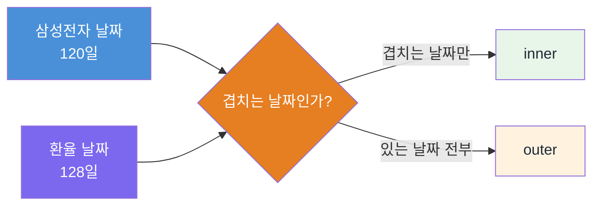

## 🕐 여러 종목을 한 표에 — 시간축을 맞추고, 합치고, 빈칸을 채운다

> [!info] 학습 목표
>
> - `pd.to_datetime()`으로 문자열 날짜를 `DatetimeIndex`로 바꾸는 이유를 설명한다.
> - `DatetimeIndex` 기반 기간 슬라이싱을 직접 수행한다.
> - `pd.merge()`의 inner/outer 차이와 그 결과로 NaN이 왜 생기는지 설명한다.
> - 가격에 대한 `ffill`과 수익률에 대한 `ffill`이 왜 다른지 구분한다.
> - 종목 두 개와 환율까지, 여러 자산을 한 표 위에 나란히 놓는다.

---

## §1 [[FD-02-600__returns-pipeline|600]]에서 만든 표는 종목 하나였다

[[FD-02-600__returns-pipeline|600]]에서 삼성전자 하나의 수익률 표를 완성했다. 같은 방식을 NAVER에도 적용하면 표가 하나 더 생긴다. 그런데 두 표를 나란히 열어놓고 "1월 6일에 어느 쪽이 더 크게 움직였나"를 눈으로 비교하는 것과, 한 표 안에서 같은 행에 두 값을 놓고 비교하는 것은 다른 일이다.

한 표에 모으려면 먼저 확인할 것이 있다. 두 표의 `Date` 열이 정말 같은 형식인가. 지금 `read_csv`로 읽은 두 표의 `Date`는 둘 다 문자열이다. 문자열끼리는 `'2026-01-02'`와 `'2026-1-2'`가 다른 값으로 취급된다 — 사람 눈에는 같은 날이어도 컴퓨터에게는 다른 이름표다. 오늘 배울 것은 이 표들을 같은 시간축 위에 올리고, 합치고, 합친 자리에 생기는 빈칸을 다루는 법이다.

## §2 문자열은 날짜가 아니다

`samsung_005930.csv`를 읽은 직후 `Date` 열의 실제 타입을 확인해본다.

**§500-1**
```python
import pandas as pd

samsung = pd.read_csv('data/samsung_005930.csv')
print(type(samsung['Date'].iloc[0]))

# 예상 출력: <class 'str'>
```

`str`이다. `'2026-03-04'`라는 값은 사람 눈에는 날짜지만 pandas 눈에는 그냥 글자다. 정렬은 되지만 "3월만 꺼내기" 같은 날짜 연산은 안 된다. `pd.to_datetime()`이 이 문자열을 날짜 전용 타입으로 바꾸고, `set_index()`로 그 열을 행 이름표 자리에 앉힌다.

**§500-2**
```python
samsung['Date'] = pd.to_datetime(samsung['Date'])
samsung = samsung.set_index('Date')
print(samsung.index[:3])

# 예상 출력:
# DatetimeIndex(['2026-01-02', '2026-01-05', '2026-01-06'],
#               dtype='datetime64[us]', name='Date', freq=None)
```

`DatetimeIndex` — 날짜가 행 이름이 된 상태다. 문자열 인덱스와 뭐가 다른지는 다음 절에서 손으로 확인한다.

| 하려는 일 | 문자열 인덱스 | `DatetimeIndex` |
|---|---|---|
| 3월 데이터만 꺼내기 | 직접 문자열 비교 코드를 짜야 함 | `.loc['2026-03']` 한 줄 |
| 두 표를 날짜 기준으로 합치기 | 형식이 다르면 조용히 실패 | 날짜끼리 정확히 비교 |
| 요일·월 정보 추출 | 직접 파싱 필요 | `.index.month`, `.index.day_of_week` |

NAVER와 새로 쓸 환율 표에도 같은 변환을 적용한다. 세 표 전부 문자열 `Date`로 시작했으니, 셋 다 이 두 줄을 거쳐야 한다.

**§500-3**
```python
naver = pd.read_csv('data/naver_035420.csv')
naver['Date'] = pd.to_datetime(naver['Date'])
naver = naver.set_index('Date')

usdkrw = pd.read_csv('data/usdkrw.csv')
usdkrw['Date'] = pd.to_datetime(usdkrw['Date'])
usdkrw = usdkrw.set_index('Date')

# 예상 출력: 없음 — 인덱스 변환만 수행한다
```

## §3 날짜를 좌표처럼 쓴다 — 기간 슬라이싱

`DatetimeIndex`가 생기면 날짜 범위를 행 자르듯 꺼낼 수 있다.

**§500-4**
```python
mar = samsung.loc['2026-03']
print(mar.shape)

# 예상 출력: (21, 6)
```

3월 한 달치 거래일 21행이 한 줄로 뽑힌다. 문자열 인덱스였다면 "3월로 시작하는 값만"을 직접 코드로 짜야 했을 자리다. 범위도 그대로 확장된다.

**§500-5**
```python
q2 = samsung.loc['2026-03':'2026-05']
print(q2.shape)

# 예상 출력: (61, 6)
```

3월부터 5월까지 61개 거래일. `loc`의 끝 포함 규칙은 [[FD-02-400__indexing-filter|400]]에서 이미 배운 그대로다 — `'2026-05'`까지 포함해서 잘린다.

## §4 합치려면 픽스처가 하나 더 필요하다

삼성전자와 NAVER는 둘 다 KRX에 상장된 종목이라 거래일이 완전히 같다. 이 둘만 합치면 빈칸이 하나도 안 생긴다 — 합치는 연습은 되어도 "빈칸을 채운다"는 이번 노트의 두 번째 목표를 체험할 수 없다.

원/달러 환율(`usdkrw.csv`)을 새로 준비한 이유가 이것이다. 환율은 은행 간 거래로 움직이는 시장이라, 국내 증시가 쉬는 날에도 값이 매겨진다. 세 표의 행 수를 직접 세어보면 차이가 바로 보인다.

**§500-6**
```python
print(samsung.shape[0], naver.shape[0], usdkrw.shape[0])

# 예상 출력: 120 120 128
```

삼성전자·NAVER가 120거래일인데 환율은 같은 기간 128행이다 — 여덟 날 차이가 바로 KRX만 쉬는 날이다. 같은 날짜 위에 놓으면 이 여덟 날에서 무슨 일이 벌어지는지가 이번 절의 핵심이다.

## §5 합치기 — `pd.merge()`의 inner와 outer

두 표를 날짜 기준으로 합치는 방법은 `pd.merge()`다. `how` 인자로 합치는 규칙을 고른다.



**§500-7**
```python
inner = pd.merge(
    samsung[['Close']].rename(columns={'Close': 'Samsung'}),
    usdkrw[['Close']].rename(columns={'Close': 'USDKRW'}),
    left_index=True, right_index=True, how='inner'
)
print(inner.shape)
print(inner.isnull().sum())

	# 예상 출력:()
# (120, 2)
# Samsung    0
# USDKRW     0
```

inner는 **둘 다 값이 있는 날짜만** 남긴다. 삼성전자가 120일 있으니 결과도 120행 — 환율의 여덟 날은 그냥 버려진다. NaN은 하나도 안 생기지만, 데이터를 잃는다.

**§500-8**
```python
outer = pd.merge(
    samsung[['Close']].rename(columns={'Close': 'Samsung'}),
    usdkrw[['Close']].rename(columns={'Close': 'USDKRW'}),
    left_index=True, right_index=True, how='outer'
)
print(outer.shape)
print(outer.isnull().sum())

# 예상 출력:
# (128, 2)
# Samsung    8
# USDKRW     0
```

outer는 **어느 한쪽이라도 값이 있으면** 남긴다. 128행 전부 살아남는 대신, 삼성전자가 없는 여덟 날은 `Samsung` 칸이 NaN으로 남는다.

## §6 NaN은 오류가 아니라 "그날 그 시장이 쉬었다"는 정보다

어느 여덟 날인지 직접 뽑아본다.

**§500-9**
```python
gap_dates = outer[outer['Samsung'].isnull()].index
print(list(gap_dates.strftime('%Y-%m-%d')))

# 예상 출력:
# ['2026-02-16', '2026-02-17', '2026-02-18', '2026-03-02',
#  '2026-05-01', '2026-05-05', '2026-05-25', '2026-06-03']
```

설 연휴(2/16~2/18), 삼일절 대체휴일(3/2), 근로자의 날(5/1), 어린이날(5/5), 부처님오신날(5/25), 현충일 관련 휴장(6/3) — 전부 국내 증시만 쉬는 날이다. 환율은 이 날에도 값이 있다. `Samsung` 칸의 NaN은 계산이 잘못된 자리가 아니라 "이 날 코스피가 닫혀 있었다"는 사실 그 자체다.

> [!tip] 💬 학생이 흔히 헷갈리는 포인트
> - NaN을 보면 코드가 틀렸다고 의심하기 쉽다.
> - 여기서는 반대다. NaN이 하나도 없었다면 오히려 이상하다 — 국내 증시 휴장일과 해외에서도 거래되는 환율의 캘린더가 다르다는 사실 자체가 이 데이터의 특징이다.

## §7 `ffill` — 가격에는 맞고, 수익률에는 틀리다

빈칸을 어떻게 채울지가 다음 질문이다. 금융에서 표준적인 방법은 `ffill()` — 직전 값을 그대로 끌어오는 것이다. "오늘 시장이 닫혀 있으면 마지막 거래 가격이 현재 가격"이라는 관행을 그대로 코드로 옮긴 것이다.

**§500-10**
```python
filled = outer.ffill()
print(filled.isnull().sum())

# 예상 출력:
# Samsung    0
# USDKRW     0
```

빈칸이 전부 채워졌다. 그런데 여기서 멈추면 함정에 빠진다. **`ffill`은 가격에 적용할 때와 수익률에 적용할 때 전혀 다른 결과를 낸다** — 같은 함수라고 방금 본 결과가 그대로 옮겨가지 않는다. 아래 §500-11에서 그 차이를 직접 확인한다.

먼저 틀린 순서부터 손으로 짚어본다 — 결측이 섞인 가격에서 곧바로 `pct_change()`를 계산하고, 그 결과를 나중에 채우는 순서다.

**§500-11**
```python
returns_wrong = outer.pct_change()
print(returns_wrong.loc['2026-02-13':'2026-02-19', ['Samsung']])

# 예상 출력:
#             Samsung
# Date
# 2026-02-13  0.012759
# 2026-02-16       NaN
# 2026-02-17       NaN
# 2026-02-18       NaN
# 2026-02-19       NaN

returns_wrong_filled = returns_wrong.ffill()
print(returns_wrong_filled.loc['2026-02-13':'2026-02-19', ['Samsung']])

# 예상 출력:
#             Samsung
# Date
# 2026-02-13  0.012759
# 2026-02-16  0.012759
# 2026-02-17  0.012759
# 2026-02-18  0.012759
# 2026-02-19  0.012759
```

`ffill`이 2/13일의 수익률 +1.28%를 그대로 4일 내내 복사했다. 이 표만 보면 삼성전자가 2/16~2/19까지 나흘 연속 +1.28%씩 오른 것처럼 보인다 — 실제로는 그 사흘간 코스피가 아예 열리지 않았고, 2/19의 진짜 수익률은 이 값과 다르다. **수익률에 `ffill`을 쓰면 존재한 적 없는 상승일을 만들어낸다.**

맞는 순서는 가격을 먼저 채우고, 그 다음에 수익률을 계산하는 것이다.

**§500-12**
```python
returns_right = outer.ffill().pct_change()
print(returns_right.loc['2026-02-13':'2026-02-19', ['Samsung']])

# 예상 출력:
#             Samsung
# Date
# 2026-02-13  0.012759
# 2026-02-16  0.000000
# 2026-02-17  0.000000
# 2026-02-18  0.000000
# 2026-02-19 -0.009449
```

가격을 먼저 채우면 휴장일의 가격은 "어제와 같은 값"이 되고, 그 값끼리 수익률을 계산하면 0%가 나온다 — "그날은 안 움직였다"는 사실과 정확히 일치하는 결과다. 그리고 2/19에 코스피가 다시 열리면, 진짜 수익률(-0.94%)이 2/13 대비가 아니라 "채워둔 2/18 가격" 대비로 정확하게 계산된다.

> [!warning] ⚠️ 오개념 — 수익률에 `ffill`을 바로 쓰면 안 된다
> - 틀린 순서: 결측 섞인 수익률 → `ffill()` → 존재하지 않는 상승/하락일이 생긴다.
> - 맞는 순서: 가격 → `ffill()` → 그 다음 `pct_change()`.
> - 이유: 가격을 채우는 것은 "휴장일엔 어제 가격이 유효하다"는 실제 관행이지만, 수익률을 채우는 것은 "휴장일에도 어제와 같은 수익이 났다"는 지어낸 사실이다.

## §8 세 자산을 한 표 위에

이제 삼성전자, NAVER, 환율까지 세 자산을 한 표에 모은다. `merge()`를 두 번 이어 쓰면 된다.

**§500-13**
```python
# naver, usdkrw는 §500-3에서 이미 DatetimeIndex로 바꿔 둔 상태다
three = (
    samsung[['Close']].rename(columns={'Close': 'Samsung'})
    .merge(naver[['Close']].rename(columns={'Close': 'Naver'}), left_index=True, right_index=True, how='outer')
    .merge(usdkrw[['Close']].rename(columns={'Close': 'USDKRW'}), left_index=True, right_index=True, how='outer')
)
print(three.shape)
print(three.isnull().sum())
print(three.loc['2026-02-13':'2026-02-19'])

# 예상 출력:
# (128, 3)
# Samsung    8
# Naver      8
# USDKRW     0
#             Samsung     Naver   USDKRW
# Date
# 2026-02-13  63500.0  388900.0  1425.57
# 2026-02-16      NaN       NaN  1430.00
# 2026-02-17      NaN       NaN  1430.00
# 2026-02-18      NaN       NaN  1427.63
# 2026-02-19  62900.0  390600.0  1419.64
```

두 국내 종목의 NaN이 같은 날짜에 함께 생긴다 — 둘 다 KRX 거래일에 매여 있어서다. 환율만 그 날에도 값을 갖는다. 이 한 표가 [[FD-02-600__returns-pipeline|600]]의 "종목 하나의 수익률 표"에서 한 단계 더 나아간 자리다. 여러 자산을 나란히 놓고 비교하려면, 시간축을 맞추고(§2~§3) 합치고(§5) 빈칸의 뜻을 이해한 뒤 올바른 순서로 채우는(§7) 이 네 단계를 거쳐야 한다.

실습에서는 세 CSV를 직접 읽어 이 파이프라인을 처음부터 다시 짠다 — 문자열 날짜를 `DatetimeIndex`로 바꾸는 단계부터 세 자산을 한 표에 모으는 단계까지.

> [!warning] 투자 주의
> - 이 노트의 데이터와 예시는 학습용으로 구성한 참고 자료다.
> - 실제 투자 결정과 그 책임은 전적으로 본인에게 있다.

---

## 🔖 핵심 요약

> [!summary] 🏆 이 노트를 마쳤다면?
>
> - [ ] `pd.to_datetime()`으로 문자열 날짜를 `DatetimeIndex`로 바꾸는 이유를 설명할 수 있다.
> - [ ] `.loc['2026-03']`처럼 기간 슬라이싱을 직접 수행할 수 있다.
> - [ ] `pd.merge()`의 inner/outer 차이와 그 결과로 NaN이 왜 생기는지 설명할 수 있다.
> - [ ] 가격에 대한 `ffill`은 맞고 수익률에 대한 `ffill`은 틀린 이유를 구분할 수 있다.
> - [ ] 실습에서: 삼성전자·NAVER·환율 세 CSV를 날짜 기준으로 합치고, 빈칸을 올바른 순서로 채운다.
