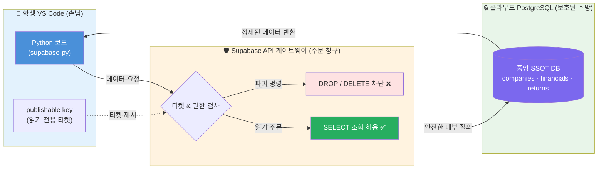
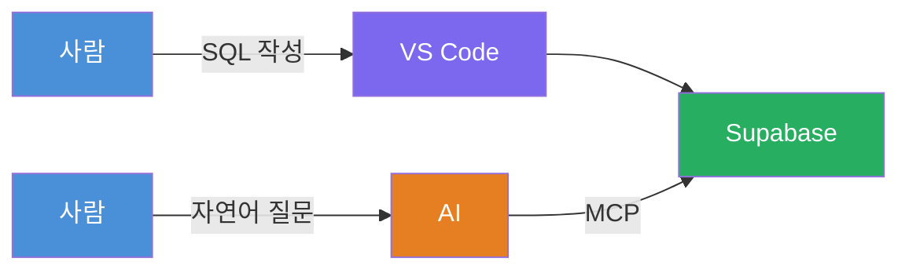

## 같은 질문을 다른 DB에 던진다

> [!info] 학습 목표
>
> - SQLite에서 조회하던 세 표를 클라우드 PostgreSQL(Supabase)에서 이번 주에 직접 다시 조회한다.
> - 무엇이 그대로 통하고 무엇이 다른지, 실제 사례로 말한다.
> - AI가 자연어로 DB에 접근하는 방식(MCP)이 무엇인지 알고, 결과 검증은 여전히 사람의 몫이라는 것을 안다.

---

## ☁️ 내 노트북 DB에 던진 질문이 클라우드에도 통한다

지금까지는 `market_data.db`라는 내 노트북 위의 파일에 SQL을 던졌다. 이번 노트의 핵심 경험은 하나다 — **[[FD-03-300__sql-remind|300]]·[[FD-03-200__sqlite-open|200]]에서 SQLite에 던졌던 조회를, 같은 세 표(`companies`·`financials`·`returns`)를 담은 클라우드 PostgreSQL(Supabase)에 이번 주에 직접 다시 던진다.** 새 쿼리를 만드는 게 목적이 아니라, "같은 데이터가 다른 곳에서도 같은 방식으로 잡힌다"는 것 자체가 요점이다.

접속은 SQL 문자열이 아니라 Supabase 공식 파이썬 클라이언트(`supabase-py`)로 표 단위 조회를 보낸다 — 방법은 아래 §600-2·§600-3에서 직접 실행한다. [[FD-03-300__sql-remind|300]]의 `GROUP BY` 같은 복잡한 집계까지 그대로 옮기는 것은 아니다 — `supabase-py`의 `select()`는 표 하나를 그대로 읽어오는 기본 조회다. 이번 주 실행하는 것은 그 기본 조회이고, SQL로 더 복잡한 질문을 던지는 길은 아래 MCP 절에서 짚고 넘어간다.

- **이번 주 — 학생이 직접 접속한다.** 읽기 전용(anonymous, `SELECT`만 허용) publishable key로 클라우드 DB에 연결해 조회를 자기 화면에서 실행한다. 실수로 데이터를 바꾸거나 지울 수 없다.
- 실습 노트북(§600-2, §600-3)에서 `companies`·`financials`·`returns` 세 표를 차례로 조회한다.

> [!warning] 노트북에 넣어도 되는 key, 넣으면 안 되는 것
> - `publishable key`는 클라이언트가 프로젝트를 식별하는 공개 키다 — 이것만으로 쓰기·관리 권한이 생기지 않으므로 노트북에 그대로 둔다.
> - `service_role` key, 개인 액세스 토큰, DB 비밀번호는 절대 노트북에 적지 않는다 — 이 세 가지는 관리자 권한이다.
> - DB는 Row Level Security(RLS)로 보호되며, 학생 노트북에는 세 표의 `SELECT`만 허용된다 — `INSERT`·`UPDATE`·`DELETE`는 애초에 막혀 있다.

### 🛡️ 왜 데이터베이스를 외부에 직접 열지 않고 API 창구를 거칠까?
내 노트북의 SQLite는 내 컴퓨터 안의 로컬 파일이므로 파이썬이 직접 열어도 안전합니다. 하지만 클라우드 DB는 전 세계 인터넷에 연결되어 있습니다. 만약 원격 데이터베이스를 외부에 그대로 노출해두면, 누군가 실수나 악의로 `DROP TABLE financials;` 같은 파괴적인 쿼리를 던져 전교생의 DB를 0.1초 만에 날려버릴 수 있습니다.

그래서 클라우드 DB 앞에는 **API 게이트웨이(안전한 주문 창구)**를 방패로 둡니다.


*학생 노트북에는 파괴 권한이 아예 없는 '읽기 전용 공개키'만 주어지므로, 실수로 데이터를 지우거나 바꿀 위험이 원천 차단됩니다.*

## 🆚 무엇이 다른가 — 경계 있는 연속성

"거의 그대로 통한다"는 말에는 경계가 있다. 과장하면 나중에 "SQLite에서는 됐는데 왜 안 되지"를 혼자 만나게 된다.

| 그대로 통하는 것 | 다른 것 |
|---|---|
| `SELECT` · `WHERE` · `ORDER BY` · `LIMIT` | 타입 처리 방식 |
| `GROUP BY` · 집계 함수 | 날짜 함수 (`strftime` ↔ `date_trunc`) |
| `JOIN ... ON` | 엄격함의 정도 (아래 참조) |

말로만 하지 않고 실제로 한 번 겪어본다. [[FD-03-300__sql-remind|300]]에서 SQLite가 숫자 열에 문자열을 넣어도 에러 없이 받아준다는 걸 봤다 — 이번엔 그 값으로 계산까지 시켜본다.

**§600-1**
```python
# §FD-03-600-1
import sqlite3

test_conn = sqlite3.connect(':memory:')
test_conn.execute("CREATE TABLE t (revenue INTEGER)")
test_conn.execute("INSERT INTO t (revenue) VALUES ('오류아님')")  # 숫자 열에 문자열
test_conn.commit()

print(test_conn.execute("SELECT revenue, typeof(revenue) FROM t").fetchall())
print(test_conn.execute("SELECT revenue + 1000 FROM t").fetchall())

# 예상 출력:
# [('오류아님', 'text')]
# [(1000,)]
```

SQLite는 숫자 열에 문자열이 들어와도 에러를 내지 않고 그대로 저장한다(`typeof`가 `text`로 나온다). 심지어 그 값에 `+ 1000`을 해도 에러 없이 `1000`이 나온다 — 문자열이 조용히 0으로 취급된 것이다.

**PostgreSQL은 이 자리에서 바로 타입 에러를 낸다.** 방금 SQLite에서 실행한 것과 같은 삽입을 PostgreSQL에서 시도하면 이런 메시지를 만난다(PostgreSQL 공식 문서 기준 — 이 노트에서 직접 실행한 결과는 아니다).

```text
# PostgreSQL 예상 에러:
# ERROR:  invalid input syntax for type integer: "오류아님"
```

에러 없이 조용히 저장되는 것과, 그 자리에서 바로 멈추는 것 — 이 차이가 "그대로 통하는 것"과 "다른 것"을 가르는 실제 경계다. SQLite에서 통과하던 코드가 클라우드로 넘어가면 여기서 처음 걸릴 수 있다는 뜻이다. 표 값을 담을 열의 타입을 미리 정확히 지키는 습관이, SQLite에서는 "그래도 되니까" 느슨해지기 쉽다는 걸 기억해둔다.

날짜 관련 함수도 이름이 다르다 — SQLite의 `strftime`이 하던 일을 PostgreSQL에서는 `date_trunc` 계열이 담당한다. 지금 당장 외울 필요는 없다. "이름이 다르구나" 정도만 알아두면, 나중에 실제로 마주쳤을 때 무엇을 검색해야 할지 감이 잡힌다.

## ☁️ Supabase에서 직접 재실행

먼저 프로젝트에 연결한다. `SUPABASE_URL`과 `SUPABASE_PUBLISHABLE_KEY`는 실습 노트북에 이미 채워져 있다. 수업 커널(FD_26)에는 `supabase` 패키지가 이미 설치되어 있다 — `from supabase import create_client`에서 `ImportError`가 나면 커널 선택을 먼저 확인하고, 그래도 없으면 FD_26 프로젝트 루트에서 `uv add supabase`를 한 번 실행한다.

**§600-2**
```python
# §FD-03-600-2
from supabase import create_client

SUPABASE_URL = "https://jiwbvsikariknyynvrmr.supabase.co"
SUPABASE_PUBLISHABLE_KEY = "<수업 노트북에 제공된 publishable key>"
supabase = create_client(SUPABASE_URL, SUPABASE_PUBLISHABLE_KEY)

# 예상 출력: 없음 — 연결 객체만 만든다.
```

연결에 성공하면, 표 이름만 바꿔서 세 표를 차례로 조회한다. 화면이 길어지지 않게 처음에는 `.limit(5)`로 다섯 행만 본다.

**§600-3**
```python
# §FD-03-600-3
companies = supabase.table("companies").select("*").limit(5).execute().data
pd.DataFrame(companies)

# 예상 출력: companies 표의 앞 5행 — code, name, sector, market 열.
# 내 노트북의 market_data.db companies 표와 값이 같다.
```

`financials`·`returns`도 표 이름만 바꾸면 같은 방식으로 확인할 수 있다. 내 노트북 위 파일 하나에만 있던 표가 지금 클라우드에도 똑같이 있고, 똑같은 방법(연결 → `select` → `execute`)으로 잡힌다는 것이 이번 주의 회수 지점이다.

## 🔬 어딘가에 하나 있는 것

내 노트북 DB든 클라우드 DB든, 화면에는 똑같이 표가 나온다. 그것만 보면 차이가 잘 안 와닿는다. 여기서 한 단계 더 나아간 경험은 — **교수가 클라우드 DB의 데이터를 그 자리에서 하나 바꾸고, 학생들이 같은 조회를 다시 실행해 답이 바뀐 것을 확인하는 것**이다. 이 경험은 학생 계정에 쓰기 권한이 없어 학생이 직접 데이터를 바꾸는 것과는 다르다 — 교수가 바꾸고 학생은 읽기만 한다.

교수는 학생과 같은 publishable key가 아니라 본인 컴퓨터에 이미 연결해 둔 별도 경로(Supabase Dashboard 또는 `supabase link`로 연결한 CLI)로 `companies` 표의 값 하나를 직접 바꾼다 — 이 경로는 학생 노트북 어디에도 등장하지 않으므로 새 key를 노출할 필요가 없다. 학생은 위 §600-3 셀을 코드 변경 없이 그대로 다시 실행해서 바뀐 값을 확인한다 — 같은 셀이 다른 결과를 내는 것 자체가 이번 활동의 요점이다. 접속에 성공한 학생은 자기 화면에서 직접 확인하고, 접속에 실패한 학생은 교수 화면에서 같은 결과를 함께 본다. 두 경우 모두 각자 개인 단독으로 완결되는 확인이라 짝 활동 금지 규칙에 걸리지 않는다.

## 🤖 자연어로 물어보기 — MCP

여기까지는 사람이 직접 SQL을 써서 DB에 물었다. **MCP(Model Context Protocol)** 는 AI가 파일이나 DB 같은 바깥 시스템에 **정해진 통로로** 접근하도록 해주는 규약이다. MCP를 끼우면, 지금까지 사람이 서 있던 자리에 AI가 대신 설 수 있다.


*위 줄은 방금 학생이 한 것 — 사람이 SQL을 써서 Supabase에 묻는다. 아래 줄은 MCP가 하는 일 — 질문을 쓰는 사람이 자연어를 쓰는 사람으로 바뀔 뿐, DB는 똑같은 Supabase다.*

바뀐 것은 "질문을 쓰는 방법"이지 DB 자체가 아니다. 교수 화면 시연도 클라우드 DB와 마찬가지로 credential-safe 시연이 실제로 공급된 뒤에 한두 번 짧게 보여준다 — 19명이 각자 새로 환경을 설정하는 일은 주어진 시간 안에 끝나지 않는다.

> [!warning] SQL을 몰라도 된다는 뜻이 아니다
> - MCP가 대신 쿼리를 써준다고 해서 SQL과 DB를 몰라도 된다는 뜻은 아니다.
> - 오히려 반대다 — SQL과 DB가 무엇인지 아는 상태여야, AI가 만들어낸 쿼리와 그 결과가 말이 되는지 스스로 판단할 수 있다.
> - 결과를 사람이 검증해야 한다는 원칙("Trust but Verify")은 뒤에서 다시 만난다.

자연어로 직접 물어보는 실습은 이번 주가 아니라 다음 주로 넘어간다. 지금은 "이런 것도 가능하다"는 것만 알아두면 충분하다.

클라우드 DB를 처음부터 구축하는 일(프로젝트 생성, 테이블 만들기, 데이터 넣기)은 이 수업의 범위가 아니다 — 학생은 이 과정을 직접 하지 않는다.

이번 주 실습에서는 §600-1의 타입 경계 코드와 §600-2·§600-3의 Supabase 직접 재실행, 그리고 교수가 데이터를 바꾼 뒤 같은 셀을 다시 실행해 확인하는 재조회까지 모두 포함한다 — 학생 계정(anonymous, 읽기 전용)과 클라우드 DB가 이미 준비되어 있다.

## 🚀 다음 주 예고: 실전 API에서 OpenDART 퀀트 파이프라인으로

이번 3주차에서 우리는 금융 시계열 데이터를 안전하게 담아둘 **나만의 로컬 DB(SQLite)**를 구축하고, 외부 세상과 데이터를 주고받을 때 왜 **API 창구**를 거쳐야 하는지 배웠습니다.

다음 4주차에는 진짜 외부 세상의 대표적인 금융 API인 **금융감독원 전자공시시스템(OpenDART) API**를 직접 다룹니다.
- 토스증권이 기업 공시를 가져오는 것과 똑같이, 금융감독원에서 나만의 API 인증키를 발급받습니다.
- 파이썬 코드로 상장사들의 사업보고서 재무제표를 호출해 옵니다.
- 그리고 이번 주에 배운 SQLite DB에 그 재무데이터를 차곡차곡 적재하여, 나만의 기본적 분석(PER·ROE 팩터 스크리닝) 퀀트 파이프라인을 구축합니다.

---

## 🔖 핵심 요약

> [!summary] 🏆 이 노트를 마쳤다면?
>
> - [ ] `companies`·`financials`·`returns` 세 표가 내 노트북의 SQLite와 클라우드 PostgreSQL(Supabase) 양쪽에서 같은 방법으로 조회된다는 것을 직접 실행해 확인했다.
> - [ ] SQLite와 PostgreSQL 사이에 그대로 통하는 것과 다른 것(타입·날짜 함수)을 예를 들어 설명할 수 있다.
> - [ ] MCP가 "질문을 쓰는 사람"을 사람에서 AI로 바꿀 뿐 DB 자체를 바꾸지 않는다는 것을 설명할 수 있다.
> - [ ] AI가 만든 쿼리 결과도 사람이 검증해야 한다는 원칙을 안다.
> - [ ] 실습에서: §600-1의 SQLite 타입 경계 코드와 §600-2·§600-3의 Supabase 직접 재실행을 실행해 확인한다.
> - [ ] 교수가 데이터를 바꾼 뒤 같은 §600-3 셀을 코드 변경 없이 다시 실행해, 결과가 달라진다는 것을 확인했다.
