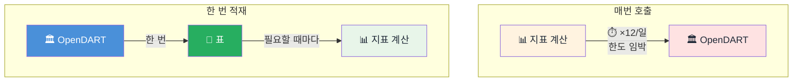

## 📊 주가만 보고 사도 될까?

> [!info] 학습 목표
>
> - 주가만 보고 기업을 판단하면 왜 위험한지 설명한다.
> - 재무제표가 기업의 무엇을 보여주는지(자산·부채·자본, 매출·이익) 구분한다.
> - PER·PBR·ROE가 "받은 숫자를 해석하는 눈"이라는 감을 갖는다.

---

## 📡 왜 받아서 쌓아두나 — 매번 부르지 않는 이유 셋

> [!info] Mark의 경험담
> "알고리즘 트레이딩을 할 때 매번 API 호출하면 rate limit, latency 등 걸리니까 누적해서 적재해서 투자 지표 같은거 계산할 때 활용할 수 있으니까."

필요할 때마다 서버에 물어보면 될 것 같지만, 실제로 돌려보면 세 가지 벽에 부딪힌다.
- **한도** — 서버마다 하루에 받을 수 있는 호출 횟수가 정해져 있다. 넘으면 그날은 더 못 받는다.
- **지연** — 호출 한 번에 수백 밀리초가 걸린다. 지표 하나를 계산하는 데 여러 번 불러야 하면 그 지연이 그대로 쌓인다.
- **재현성** — 같은 기업의 같은 연도 숫자도 나중에 정정공시로 바뀔 수 있다. 오늘 받은 값을 저장해두지 않으면 "지난주에 계산했던 그 숫자"를 다시 만들 수 없다.

셋 중 실무에 끝까지 남는 이유는 재현성이다. 그래서 오늘은 한 번 받아 저장해두고, 그 저장된 값으로 지표를 계산한다.


- 위(매번 호출)는 계산할 때마다 서버를 다시 부른다 — 화살표 하나가 하루 열두 번씩 반복돼 한도에 걸린다.
- 아래(한 번 적재)는 서버를 딱 한 번만 부르고, 그 결과를 표에 저장해둔 뒤 계산은 그 표에서 몇 번이든 한다.

---

## 💬 "요즘 이 종목 오른다던데, 사도 될까?"

친구가 종목 하나를 추천한다. 최근 며칠 주가가 계속 오르고 있다는 이유다. 여기서 "지금 사도 될까?"에 주가 하나만으로 답할 수 있을까.

주가는 오늘 시장이 매긴 가격일 뿐이다. 그 가격이 회사의 체력에 비해 싼지 비싼지는 주가 혼자서는 말해주지 않는다. 두 회사를 나란히 세워보면 이 감이 더 분명해진다.

![[FD-04-100-revenue-profit-compare.png]]
- 삼성전자와 SK하이닉스의 2024→2025년 매출·영업이익·당기순이익을 조원 단위로 겹쳐 놓은 그래프다 — **Week03에 적재해 둔 `financials` 테이블의 예시 값**(수업 실습용 seed 데이터)으로 그렸다. 이 노트에서는 "비교가 왜 필요한가"라는 감을 잡는 것이 목적이고, 삼성전자의 실제 검증된 숫자는 [[FD-04-500__load-and-measure|§500]]에서 OpenDART로 직접 받아 다시 확인한다.
- 두 회사 모두 2025년 숫자가 2024년보다 커졌다는 점, 그리고 매출 규모 차이만큼 이익 규모 차이도 벌어졌는지를 눈으로 비교해 본다.

이 그래프 어디에도 "오늘 주가"는 없다. 그런데도 "이 회사가 지금 얼마나 잘 벌고 있나"는 이미 읽을 수 있다. ==주가는 시장의 기대이고, 재무제표는 회사의 실적이다.== 이 둘이 항상 같이 움직이지는 않는다는 것이 "주가만 보면 위험하다"는 말의 핵심이다.

---

## 🩺 재무제표는 기업의 건강검진표다

병원에서 건강검진을 받으면 혈압·혈당·콜레스테롤 같은 수치가 나온다. 숫자 하나하나가 "정상 범위"와 비교되면서 의미를 갖는다. 재무제표도 똑같다 — 기업이 1년에 한 번(또는 분기마다) 받는 건강검진표다.

- **재무상태표(대차대조표)**: 특정 시점에 회사가 무엇을 가졌고(자산) 무엇을 빚졌고(부채) 그 차이가 얼마인지(자본)를 찍은 스냅샷.
	- `자산 = 부채 + 자본` — 이 등식은 항상 성립한다. 회사가 가진 것은 결국 남의 돈(부채)이거나 내 돈(자본)이다.
- **손익계산서**: 한 기간 동안 얼마를 벌었고(매출) 얼마가 남았는지(영업이익, 당기순이익)를 찍은 흐름표.
	- 매출에서 비용을 빼면 영업이익, 거기서 영업 외 항목(이자·배당·지분법이익 등)과 법인세를 더 반영하면 당기순이익이 나온다.
	- 법인세는 당기순이익을 깎지만, 이자수익·배당금·지분법이익 같은 영업외수익이 그보다 크면 당기순이익이 영업이익보다 커질 수 있다 — 아래 그림의 삼성전자가 그 경우다.

<figure style="margin:16px 0; background:#FAF7F0; border:1px solid #E2E8F0; border-radius:8px; padding:12px;">
  <svg viewBox="0 0 640 200" style="width:100%; max-height:240px; display:block;">
    <text x="160" y="16" fill="#0F2747" font-size="13" font-weight="bold" text-anchor="middle">BS · 재무상태표</text>
    <rect x="20" y="26" width="280" height="56" fill="#0E7C7B" fill-opacity="0.15" stroke="#0E7C7B" stroke-width="2" rx="4"/>
    <text x="160" y="50" fill="#0F2747" font-size="11" text-anchor="middle">자산총계</text>
    <text x="160" y="68" fill="#0F2747" font-size="13" font-weight="bold" text-anchor="middle">566.9조</text>
    <rect x="20" y="92" width="64" height="56" fill="#FCD34D" fill-opacity="0.35" stroke="#D97706" stroke-width="2" rx="4"/>
    <text x="52" y="116" fill="#1f2937" font-size="9" text-anchor="middle">부채총계</text>
    <text x="52" y="132" fill="#1f2937" font-size="10" font-weight="bold" text-anchor="middle">130.6조</text>
    <rect x="90" y="92" width="210" height="56" fill="none" stroke="#16A34A" stroke-width="3" rx="4"/>
    <text x="195" y="116" fill="#1f2937" font-size="9" text-anchor="middle">자본총계</text>
    <text x="195" y="132" fill="#16A34A" font-size="11" font-weight="bold" text-anchor="middle">436.3조</text>
    <text x="160" y="170" fill="#64748B" font-size="10" text-anchor="middle">자산총계 = 부채총계 + 자본총계 (566.9 = 130.6 + 436.3)</text>

    <text x="480" y="16" fill="#0F2747" font-size="13" font-weight="bold" text-anchor="middle">IS · 손익계산서</text>
    <rect x="350" y="26" width="260" height="34" fill="#0F2747" fill-opacity="0.9" rx="4"/>
    <text x="480" y="48" fill="#fff" font-size="11" text-anchor="middle">매출액 333.6조</text>
    <rect x="380" y="68" width="200" height="34" fill="#0E7C7B" fill-opacity="0.9" rx="4"/>
    <text x="480" y="90" fill="#fff" font-size="11" text-anchor="middle">영업이익 43.6조</text>
    <rect x="375" y="110" width="210" height="34" fill="none" stroke="#16A34A" stroke-width="3" rx="4"/>
    <text x="480" y="132" fill="#16A34A" font-size="11" font-weight="bold" text-anchor="middle">당기순이익 45.2조</text>
    <text x="480" y="170" fill="#64748B" font-size="10" text-anchor="middle">매출액 → 영업이익 → 당기순이익</text>
  </svg>
  <figcaption style="font-size:11.5px; color:#64748B; margin-top:6px; text-align:center;">
    <em>삼성전자 2025년 연결재무제표 6계정. 초록 테두리 두 칸(자본총계·당기순이익)은 §500에서 시가총액과 함께 PER·PBR·ROE로 다시 쓰인다.</em>
  </figcaption>
</figure>

> [!tip]- 법인세를 내도 당기순이익이 더 클 수 있는 경우
> - 영업이익: 100억 원
> - 이자·배당수익 등 영업외수익: +30억 원
> - 세전이익: 130억 원
> - 법인세: -10억 원
> - 당기순이익: 120억 원
>
> 법인세는 세전이익을 130억 원에서 120억 원으로 깎았지만, 영업외수익이 충분히 컸기 때문에 당기순이익은 영업이익 100억 원보다 여전히 크다.

건강검진에서 "혈압이 130이다"라는 숫자 자체보다 "정상 범위 대비 어디에 있나"가 중요하듯, 재무제표의 숫자도 절대값보다 **비교**에서 의미가 나온다. 다음 노트부터는 이 숫자를 컴퓨터로 직접 받아오는 방법을 다루지만, 그 전에 받은 숫자를 어떻게 읽을지부터 감을 잡아야 한다.

> [!warning] ⚠️ 흔한 착각
> - "주가가 오르고 있으니 좋은 회사다" — 주가는 기대이지 실적이 아니다.
> - 실적이 늘어도 그보다 주가가 더 많이 올라 있으면 "비싸게 사는" 것이고, 실적이 늘었는데 주가가 그대로면 "싸게 사는" 것일 수 있다.
> - 이 비교를 가능하게 하는 것이 지금부터 볼 PER·PBR·ROE다.

---

## 🔍 PER·PBR·ROE — 받은 숫자를 해석하는 세 개의 눈

같은 재무제표 숫자를 놓고도 "이 회사 지금 비싼가?"와 "이 회사 돈을 잘 굴리나?"는 다른 질문이다. 세 지표는 각각 다른 질문에 답한다.

- **PER(주가수익비율)** — "이익 대비 주가가 몇 배인가?"
	- 계산 감각: `주가 ÷ 주당순이익`. 낮을수록 "이익에 비해 싸게 거래된다"는 뜻이지만, 업종마다 평균 PER이 다르므로 절대 숫자만으로 단정하지 않는다.
- **PBR(주가순자산비율)** — "회사가 가진 순자산 대비 주가가 몇 배인가?"
	- 계산 감각: `주가 ÷ 주당순자산`. 1보다 낮으면 **시가총액이 장부상 순자산(자본총계)보다 작다**는 뜻이라 저평가 신호로 자주 언급된다 — "지금 청산하면 남는 돈"과 같은 말은 아니다. 장부상 순자산은 자산을 판다고 그대로 현금이 된다는 보장이 없는 회계상의 숫자이지, 실제 청산했을 때 손에 쥐는 금액(청산가치)이 아니다.
- **ROE(자기자본이익률)** — "내 돈(자본)으로 얼마나 벌었나?"
	- 계산 감각: `당기순이익 ÷ 자본총계`. 같은 자본으로 더 많이 벌수록 회사가 돈을 잘 굴린다는 뜻이다.

**예시 값**으로 ROE 하나만 손으로 계산해 보자(Week03 SQLite에 적재된 seed 데이터다 — 수업 실습용으로 미리 채워둔 값이지, 이번 주에 직접 받아 확인한 값이 아니다). 이 seed에서 2025년 삼성전자는 당기순이익 381,432억 원, 자본총계 3,467,567억 원으로 잡혀 있다.

**§100-1**
```python
net_income = 381_432  # 억원, Week03 financials 테이블 005930 2025 (예시 seed 값)
equity = 3_467_567    # 억원, 같은 행의 equity 값 (예시 seed 값)
roe = net_income / equity
print(f"ROE = {roe:.1%}")
# 예상 출력: ROE = 11.0%
```

자기자본 100원을 굴려 1년에 11원을 벌었다는 뜻이다. **이 11.0%는 seed 예시로 계산해본 감일 뿐, 삼성전자의 검증된 ROE가 아니다** — [[FD-04-500__load-and-measure|§500]]에서 OpenDART로 직접 받은 실제 값으로 다시 계산하면 다른 숫자(10.4%)가 나온다. 둘이 다른 이유는 seed 데이터가 실습용으로 미리 채워둔 예시 값이기 때문이지, 계산이 틀려서가 아니다. PER·PBR은 여기에 "오늘 주가"가 더해져야 계산되는데, 그 주가·주당 데이터는 [[FD-04-500__load-and-measure|§500]]에서 시세 데이터와 결합해 다룬다. 지금 이 노트에서 가져가야 할 것은 계산 공식이나 이 예시 숫자가 아니라 "이 세 지표가 같은 재무제표를 세 가지 다른 질문으로 읽는 렌즈"라는 감이다.

---

## 🔖 핵심 요약

> [!summary] 🏆 이 노트를 마쳤다면?
>
> - [ ] "주가만 보고 판단하면 위험하다"는 이유를 자기 말로 설명할 수 있다.
> - [ ] 재무상태표(자산·부채·자본)와 손익계산서(매출·이익)의 역할을 구분할 수 있다.
> - [ ] PER·PBR·ROE가 각각 어떤 질문에 답하는 지표인지 말할 수 있다.
> - [ ] 실습에서: 재무제표 원본 숫자를 직접 받아와 이 지표들을 해석해 본다([[FD-04-500__load-and-measure|§500]]에서).
