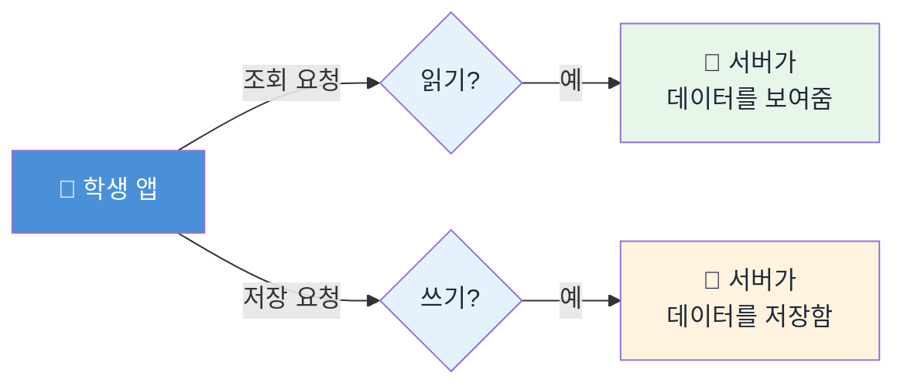
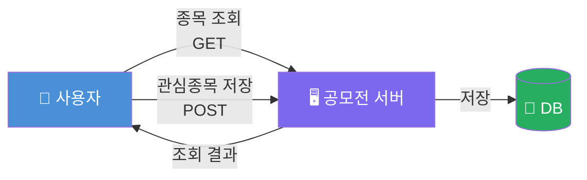
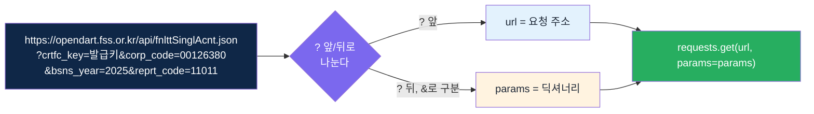
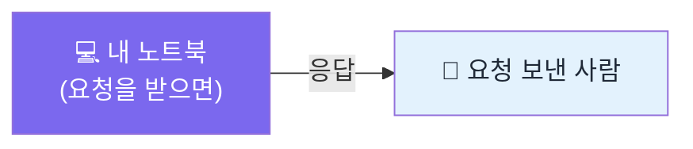

## 🔌 그 숫자, 컴퓨터는 어떻게 가져올까?

> [!info] 학습 목표
>
> - API를 "읽기(조회)"와 "쓰기(저장)" 두 동작으로 직관적으로 구분한다.
> - 조회와 저장이 실제 서비스에서 언제 쓰이는지 사례로 설명한다.
> - "내 컴퓨터도 서버가 될 수 있다"는 감을 그림 한 장으로 갖는다.

---

## 📖 조회와 💾 저장, 두 동작이 전부다

[[FD-04-100__why-and-what-to-load|§100]]에서 재무제표 숫자를 컴퓨터로 가져오는 이야기를 예고했다. 그 "가져온다"는 동작을 컴퓨터 세계에서는 API 호출이라 부른다. 복잡하게 들리지만 학생이 매일 쓰는 앱이 하는 일은 딱 두 가지로 나뉜다.

- **조회(읽기)** — "이 데이터 좀 보여줘." 서버에 있는 것을 그대로 받아오기만 한다. 쇼핑몰 앱에서 상품 목록을 보는 것, 뉴스 앱에서 기사를 읽는 것이 전부 조회다.
- **저장(쓰기)** — "이 데이터를 서버에 남겨줘." 내가 보낸 것이 서버에 새로 기록된다. 회원가입, 장바구니에 상품 담기, 즐겨찾기 등록이 저장이다.


- 같은 학생 앱에서 나가는 요청이 두 갈래로 갈린다: 데이터를 "보여달라"는 조회와 "남겨달라"는 저장.
- 어느 쪽이든 요청을 받는 쪽(서버)이 있고 보내는 쪽(클라이언트, 여기서는 학생 앱)이 있다는 점을 눈여겨본다.

기술 용어로는 조회를 `GET`, 저장을 `POST`라고 부른다. 이름은 낯설어도 방금 본 그림이 전부다 — **GET은 읽기, POST는 쓰기.**

---

## 💼 실제 사례 — 공모전 서버를 만든다면

이 구분이 왜 필요한지는 학생이 직접 서비스를 만들 때 바로 체감된다. 금융 데이터 공모전에서 "관심종목 추천 앱"을 만든다고 하자.


- 사용자가 "삼성전자 지금 얼마야?"라고 물으면 서버는 DB에서 가격을 찾아 그대로 돌려준다 — GET.
- 사용자가 "이 종목 관심목록에 추가해줘"라고 하면 서버는 그 요청을 DB에 새 행으로 기록한다 — POST.

**단순 조회와 저장이 한 서비스 안에 함께 필요한 비즈니스 케이스**가 바로 이런 앱이다. 종목 조회 화면과 관심종목 저장 버튼은 같은 서버, 다른 동작을 쓴다.

> [!tip] 💬 REST는 이름만 기억해도 된다
> - 지금 본 "URL에 조건(파라미터)을 붙여 보내면 데이터가 돌아오는 방식"을 업계에서는 REST라고 부른다.
> - [[FD-04-300__opendart-hard-way|§300]]에서 만날 OpenDART가 정확히 이 방식이다 — 지금은 이름만 기억해도 충분하다.

#### 🧩 URL 한 줄이 실제로 어떻게 조립되는가

"URL에 조건을 붙인다"는 말이 추상적으로 들릴 수 있다. [[FD-04-300__opendart-hard-way|§300]]에서 실제로 보낼 OpenDART 요청 주소를 뜯어보면, 물음표(`?`) 뒤에 `key=value`가 `&`로 이어 붙은 것뿐이다. 이 주소를 코드로 옮기면 `requests.get(url, params=params)`의 `url`과 `params`가 된다.


- `?` 앞부분(`https://.../fnlttSinglAcnt.json`)이 `url` 인자다.
- `?` 뒤에서 `&`로 이어진 `key=value` 쌍 하나하나가 `params` 딕셔너리의 항목 하나가 된다 — `crtfc_key`, `corp_code`, `bsns_year`, `reprt_code`.
- `requests`는 `url`과 `params`를 다시 합쳐서 실제로 전송할 완전한 주소를 만든다 — 문자열을 직접 이어 붙일 필요가 없다.

---

## 💻 내 컴퓨터도 서버가 될 수 있다

지금까지 "서버"는 어딘가 멀리 있는 큰 컴퓨터처럼 느껴질 수 있다. 사실 서버는 "요청을 받으면 응답하는 프로그램이 떠 있는 컴퓨터" 그 이상도 이하도 아니다.


- 지금 쓰는 노트북에서도 "요청을 받아 응답하는 프로그램"만 띄우면 그 순간부터 노트북이 서버가 된다.
- OpenDART 같은 공식 API 서버도 원리는 같다 — 규모와 신뢰도가 다를 뿐, "요청받고 응답한다"는 동작은 동일하다.

실제로 터미널 한 줄이면 이 서버를 켤 수 있다. 파이썬에는 `http.server`라는 아주 작은 내장 서버 모듈이 있다.

```bash
python3 -m http.server 8811
```

이 명령을 실행한 채로 다른 터미널(또는 브라우저)에서 같은 주소로 조회 요청 하나를 보내면, 서버를 띄운 터미널에 아래처럼 요청이 도착한 기록이 그대로 찍힌다.

```text
127.0.0.1 - - [26/Sep/2026 11:52:37] "GET /index.json HTTP/1.1" 200 -
```
- 왼쪽 `127.0.0.1`은 요청을 보낸 컴퓨터(여기서는 내 컴퓨터 자신)의 주소다.
- `"GET /index.json HTTP/1.1"`이 방금 배운 조회 요청이다 — 어떤 파일을 "보여달라"고 물은 것이다.
- 끝의 `200`은 "정상적으로 응답했다"는 상태 코드다. [[FD-04-300__opendart-hard-way|§300]]에서 만날 OpenDART 응답의 `status: "000"`도 같은 역할을 한다 — 상태를 알려주는 코드라는 점에서 같다.

이 한 장이 이번 주 실습의 출발점이다. [[FD-04-300__opendart-hard-way|§300]]에서 실제로 OpenDART라는 서버에 GET 요청을 보내고 응답을 받는 첫 경험을 한다.

---

## 🔖 핵심 요약

> [!summary] 🏆 이 노트를 마쳤다면?
>
> - [ ] API의 조회(GET)와 저장(POST)을 그림으로 구분해서 설명할 수 있다.
> - [ ] 조회와 저장이 함께 필요한 실제 서비스 사례를 하나 들 수 있다.
> - [ ] "내 컴퓨터도 서버가 될 수 있다"는 것이 무슨 뜻인지 설명할 수 있다.
> - [ ] 실습에서: OpenDART 서버에 실제 GET 요청을 보내 응답을 받아본다([[FD-04-300__opendart-hard-way|§300]]에서).
