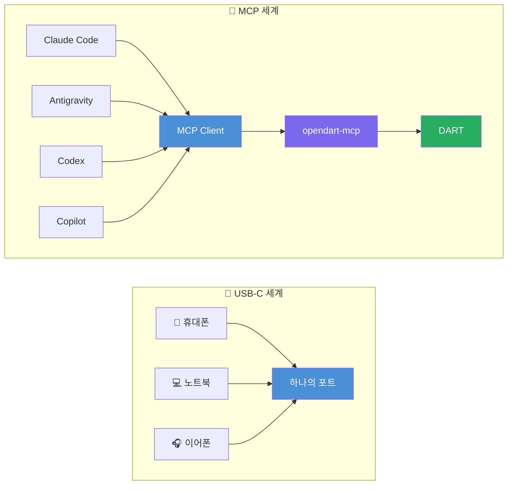
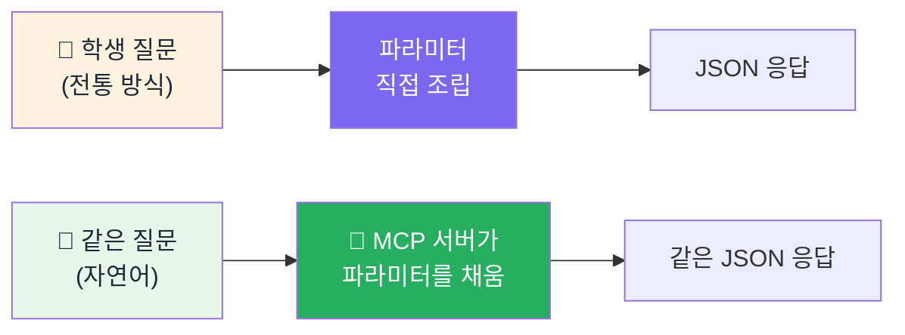

## 🔌 이 번거로움 때문에 MCP

> [!info] 학습 목표
>
> - MCP가 무엇을 해결하는 표준인지 USB-C 비유로 설명한다.
> - AI 에이전트가 파라미터를 대신 채워준다는 것의 의미를 안다.
> - 재무데이터 수업에서 써볼 만한 MCP 후보를 구분한다(이름만 아는 것과 설치까지 가능한 것).

---

## 🔌 USB-C처럼, 어디에나 꽂히는 표준

[[FD-04-300__opendart-hard-way|§300]]에서 인증키를 신청하고 `corp_code`·`bsns_year`·`reprt_code` 같은 파라미터 이름과 값을 직접 알아야 했다. 회사가 바뀌고 연도가 바뀔 때마다 이 과정을 되풀이해야 한다면 피곤한 일이다.

**MCP(Model Context Protocol)**는 AI 에이전트가 이런 외부 도구·데이터에 연결되는 방식을 표준화한 오픈 규격이다. 비유하면 **USB-C**다 — 예전에는 기기마다 다른 케이블이 필요했지만, USB-C 하나로 어떤 기기든 연결되는 것처럼, MCP 하나로 어떤 AI 에이전트든 같은 방식으로 외부 도구에 붙을 수 있다.

- 위 줄(USB-C): 기기가 무엇이든(휴대폰·노트북·이어폰) 케이블 모양은 하나다.
- 아래 줄(MCP): AI 앱이 무엇이든(Claude Code·Antigravity·Codex·Copilot) `opendart-mcp`로 가는 연결 방식은 하나다 — 두 줄의 화살표 모양이 똑같다는 점을 눈여겨본다.
- 이번 주 학생이 실제로 고르는 것은 아래 줄의 네 호스트 중 하나뿐이다. 설치 문장과 런타임별 등록 방법은 [[FD-04-410__mcp-agentic-install|§410]]에 있다.
- 더 읽어보기: [MCP 프로토콜 이해하기](https://modelcontextprotocol.info/ko/blog/understanding-mcp-protocol/) · [MCP, 이제서야 관심받는 이유](https://brunch.co.kr/@harryban0917/361)

> [!tip]- 용어로 다시 보면 (Host·Client·Server)
> - 위 그림의 Claude Code·Antigravity·Codex·Copilot이 **Host**(대화하는 AI 앱), 그 안의 MCP Client가 **Client**(서버와 통신하는 연결 부분, 학생은 직접 보지 않는다), `opendart-mcp`가 **Server**(DART API를 MCP 규격으로 감싼 쪽)다.
> - Host 안의 MCP Client가 MCP Server에 연결되고, Server 자리에 OpenDART·KRX 등 서로 다른 데이터 소스가 들어가도 에이전트 쪽 연결 방식은 항상 같다.

> [!info] 설치→질의 실제 캡처는 §410 실습에서 남긴다
> - 이 노트는 구조만 보여준다.
> - 학생이 [[FD-04-410__mcp-agentic-install|§410]]의 문장을 자기 에이전트에게 보내 설치하고 질의하는 실제 절차 캡처는 lec-practice 단계에서 Companion 실습과 함께 만들어진다.
> - 키가 필요한 실행이라 이 노트 작성 시점에는 캡처를 만들지 않는다.

---

## 🙋 "파라미터를 외울 필요가 없어진다"

MCP로 연결되면 학생이 직접 `corp_code`를 찾고 `reprt_code`를 외울 필요가 없어진다. **에이전트가 MCP 서버를 통해 그 지식을 대신 알고 있기 때문**이다. `opendart-mcp` 서버 안에는 OpenDART 공식 문서가 정의해 둔 파라미터의 뜻과 형식이 미리 담겨 있고, 에이전트는 그 정의를 읽어 학생의 자연어 질문에서 값을 뽑아 채운다.

- 위쪽은 [[FD-04-300__opendart-hard-way|§300]]에서처럼 사람이 파라미터를 직접 작성한 **파이썬 스크립트를 실행**하는 방식이고, 아래쪽은 에이전트가 MCP 서버의 도구를 호출하는 방식이다.
- 도착하는 JSON 응답 자체는 동일하다 — 달라지는 것은 "누가 파라미터를 조립하느냐"뿐이다.

<figure style="margin:16px 0; background:#FAF7F0; border:1px solid #CBD5E1; border-radius:8px; padding:16px;">
  <svg viewBox="0 0 560 550" style="width:100%; max-height:640px; display:block;">
    <rect x="10" y="10" width="540" height="34" fill="#0F2747" rx="6"/>
    <text x="280" y="34" fill="#FFFFFF" font-size="19" font-weight="bold" text-anchor="middle">전통 방식: 사람이 스크립트를 실행</text>
    <rect x="35" y="58" width="490" height="55" fill="#E2E8F0" rx="7"/>
    <text x="280" y="93" fill="#111827" font-size="21" font-weight="bold" text-anchor="middle">사람이 파라미터를 찾아 조립</text>
    <text x="280" y="132" fill="#475569" font-size="27" font-weight="bold" text-anchor="middle">↓</text>
    <rect x="35" y="145" width="490" height="55" fill="#E2E8F0" rx="7"/>
    <text x="280" y="180" fill="#111827" font-size="21" font-weight="bold" text-anchor="middle">사람이 파이썬 스크립트를 실행</text>
    <text x="280" y="219" fill="#475569" font-size="27" font-weight="bold" text-anchor="middle">↓</text>
    <rect x="35" y="232" width="490" height="55" fill="#F0FDF4" stroke="#15803D" stroke-width="4" rx="7"/>
    <text x="280" y="267" fill="#166534" font-size="21" font-weight="bold" text-anchor="middle">사람이 결과를 검증</text>
    <rect x="10" y="306" width="540" height="34" fill="#0E7C7B" rx="6"/>
    <text x="280" y="330" fill="#FFFFFF" font-size="19" font-weight="bold" text-anchor="middle">MCP 방식: 에이전트가 도구를 호출</text>
    <rect x="35" y="354" width="490" height="55" fill="#DCFCE7" stroke="#16A34A" stroke-width="3" rx="7"/>
    <text x="280" y="389" fill="#14532D" font-size="21" font-weight="bold" text-anchor="middle">사람: 자연어 질문만 입력</text>
    <text x="280" y="428" fill="#475569" font-size="27" font-weight="bold" text-anchor="middle">↓</text>
    <rect x="35" y="441" width="490" height="55" fill="#DCFCE7" stroke="#16A34A" stroke-width="3" rx="7"/>
    <text x="280" y="476" fill="#14532D" font-size="21" font-weight="bold" text-anchor="middle">에이전트: MCP 도구 실행 → 사람 검증</text>
    <rect x="10" y="510" width="540" height="34" fill="#14532D" rx="5"/>
    <text x="280" y="534" fill="#FFFFFF" font-size="18" font-weight="bold" text-anchor="middle">결론: 실행은 자동화해도, 검증은 사람이 한다</text>
  </svg>
  <figcaption style="font-size:11.5px; color:#64748B; margin-top:6px; text-align:center;">
    <em>차이는 실행 주체다. 책임까지 자동화되는 것은 아니다.</em>
  </figcaption>
</figure>

> [!tip]- Supabase MCP도 있다
> - 데이터베이스에 직접 연결하는 Supabase MCP도 존재한다 — 지금 이 노트에서 설치해보는 `opendart-mcp`와 같은 원리(자연어로 도구를 부른다)다.
> - 이 노트에서는 원리만 소개한다. **[[FD-04-600__cloud-supabase|§600]]에서 실제로 설치하고 직접 써본다** — 재무제표를 클라우드 DB에 올리고 자연어로 조회하는 단계다.

---

## 🧭 써볼 만한 금융 MCP — 이번 주는 소개만

재무데이터 수업에서 실제로 부를 만한 MCP는 여러 개가 후보로 검토됐다. 이번 주는 **이름과 역할만** 알아두고, 다음 노트에서 그중 하나를 직접 설치해본다.

- **`opendart-mcp`** — OpenDART API를 MCP로 감싼 서버. PyPI에 실제로 등록돼 있어 설치해서 바로 써볼 수 있다.
- **`openkrx-mcp`** — 한국거래소(KRX) 시세·지수 데이터를 MCP로 제공한다. 마찬가지로 PyPI 설치가 가능하다.
- 그 밖에 FRED(미국 금리·거시지표), Alpha Vantage(해외 주가) 등도 후보로 검토됐지만, 이후 주차에서 다시 다룬다 — 이번 주는 "재무제표" 중심이므로 `opendart-mcp`에 집중한다.

> [!warning] ⚠️ 이름만 아는 것과 설치 가능한 것을 구분한다
> - 검색하면 "Korea Stock MCP"처럼 KRX·DART를 합친 MCP 이름도 보이지만, 실제 배포처(PyPI)에 등록돼 있지 않은 경우가 있다.
> - 실제로 설치해서 쓸 수 있는지는 이름만 보고 판단하지 않고, 배포처에서 확인한 뒤 설치한다.

---

## 🔖 핵심 요약

> [!summary] 🏆 이 노트를 마쳤다면?
>
> - [ ] MCP를 USB-C에 빗대어 무엇을 표준화하는지 설명할 수 있다.
> - [ ] MCP가 연결되면 파라미터를 누가 대신 채워주는지 설명할 수 있다.
> - [ ] `opendart-mcp`가 이번 주 실습에서 쓸 MCP라는 것을 안다.
> - [ ] 실습에서: [[FD-04-410__mcp-agentic-install|§410]]의 자연어 한 문장을 내 에이전트에게 보내 `opendart-mcp`를 설치하고 연결을 확인한다([[FD-04-500__load-and-measure|§500]]에서 자연어 호출로 이어진다).

설치 문장과 연결 확인 방법은 [[FD-04-410__mcp-agentic-install|§410]]에 있다.
