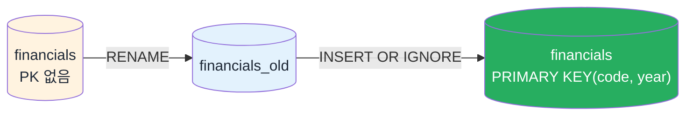

## 🗣️ 말로 시켜서 받고, 코드로 남기고, 눈으로 해석한다

> [!info] 학습 목표
>
> - [[FD-04-410__mcp-agentic-install|§410]] 문서로 설치·검증을 마친 `opendart-mcp`로 자연어 요청을 보낸다.
> - 받은 값을 `PRIMARY KEY (code, year)` 규칙으로 재구성한 `financials`에 재현 가능하게 적재한다.
> - 시가총액을 구해 PER·PBR·ROE 세 지표를 계산하고, 그 경계(연결 기준·단위·필터≠판정)를 지킨 해석 문장을 만든다.

---

## 🗣️ 설치는 §410에서 끝냈다 — 여기서는 호출한다

[[FD-04-410__mcp-agentic-install|§410]]의 절차대로 `opendart-mcp`를 등록하고, "삼성전자 2025년 사업보고서 연결 당기순이익을 알려줘"에 45.2조가 돌아오는 것까지 확인했다면 준비는 끝났다. 여기서는 그 연결로 실제 요청을 보낸다.

> [!tip] 🧰 실행 환경
> - 이 노트북에 필요한 `pandas`·`requests`·`python-dotenv`·`supabase`는 [[FD-04-410__mcp-agentic-install|§410]]에서 `FD_26` 루트에 `uv add pandas requests python-dotenv supabase`로 이미 준비해뒀다(안 했으면 지금 한 번 실행한다).
> - 노트북은 FD_26의 uv 환경으로 연다.

---

## 📥 자연어로 받고, 코드로 재현 가능하게 남긴다

준비가 끝났으면 이제 말로 요청한다. 순서는 세 단계다 — **① 요청을 보낸다 → ② 돌아온 값을 확인한다 → ③ 그 값을 코드에 옮긴다.**

> [!tip] 💬 ① 학생이 보내는 요청
> "삼성전자(corp_code 00126380) 2025년 사업보고서 **연결(CFS)** 재무제표에서 매출액, 영업이익, 당기순이익, 자본총계를 가져와줘. 단위는 억원으로 알려줘."

`연결` 기준을 명시하는 이유가 있다 — 삼성전자처럼 자회사가 많은 기업은 회사 혼자만의 실적(별도)과 자회사를 합친 실적(연결)이 다르다. [[FD-04-300__opendart-hard-way|§300]]에서 여러 행 중 CFS만 골라냈던 것과 같은 구분이다.

② [[FD-04-410__mcp-agentic-install|§410]]에서 연 VS Code Copilot Chat(Agent 모드)에 위 요청을 그대로 보낸다 — 에이전트가 `opendart-mcp`를 호출해 답을 돌려주면, **매출액·영업이익·당기순이익·자본총계 네 값과 단위(억원)가 맞는지부터 확인한다.** [[FD-04-300__opendart-hard-way|§300]]에서 직접 확인한 기준값(당기순이익 45.2조원·자본총계 436.3조원)과 같은 자리수인지 눈으로 대조해본다.

③ 확인이 끝난 네 값을 아래 `mcp_result` 딕셔너리에 그대로 옮겨 적는다 — 직접 붙여넣거나, 에이전트에게 "방금 답을 이 딕셔너리 형식의 파이썬 코드로 써줘"라고 요청해 셀을 채우게 해도 된다. 여기서 **끝나면 안 된다** — [[FD-04-300__opendart-hard-way|§300]]에서 직접 `requests`로 받은 것과 마찬가지로, 이번에도 그 값을 SQLite에 적재하는 코드가 노트북에 남아야 한다. 에이전트가 자연어로 값만 던져주고 끝나면 나중에 "이 숫자가 어디서 왔는지" 재현할 수 없다 — **직접 API 코드(§300)가 재현 가능한 수집 경로이고, 자연어(MCP)는 탐색·검증 경로다.**

`financials` 테이블은 종목(`code`)과 연도(`year`)의 조합마다 딱 한 행만 있어야 한다 — 같은 종목·연도를 다시 받아도 행이 늘어나지 않고 값만 갱신돼야 한다는 뜻이다. 그래서 `PRIMARY KEY (code, year)`로 테이블을 만들고, 적재는 `append`가 아니라 **있으면 덮어쓰고 없으면 추가**하는 방식으로 한다 — 지금까지 써온 `financials`의 seed 값은 예시였을 뿐, 이제 진짜 값으로 대체한다.

먼저 테이블을 만든다 — 이 셀은 **한 번만 실행되면 되는 준비 단계**다.


- Week03 seed 표에 `PRIMARY KEY`가 없으면 이름을 바꾸고(`financials_old`) 새 PK 표를 만들어 행을 옮긴다 — 원본은 남는다. 이미 PK가 있으면 이 세 단계 없이 아래 코드가 그대로 통과한다.

**§500-1**
```python
import sqlite3
import pandas as pd

con = sqlite3.connect("data/market_data.db")
existing_schema = con.execute(
    "SELECT sql FROM sqlite_master WHERE type='table' AND name='financials'"
).fetchone()

if existing_schema and "PRIMARY KEY" not in existing_schema[0]:
    with con:
        con.execute("ALTER TABLE financials RENAME TO financials_old")
        con.execute("""
        CREATE TABLE financials (
            code TEXT NOT NULL,
            year INTEGER NOT NULL,
            revenue INTEGER,
            operating_profit INTEGER,
            net_income INTEGER,
            equity INTEGER,
            PRIMARY KEY (code, year)
        )
        """)
        con.execute("""
        INSERT OR IGNORE INTO financials (code, year, revenue, operating_profit, net_income, equity)
        SELECT code, year, revenue, operating_profit, net_income, equity FROM financials_old
        """)
    copied = con.execute("SELECT COUNT(*) FROM financials").fetchone()[0]
    print(f"옛 표(financials_old)에서 {copied}행을 새 PK 표로 옮겼다 — 원본은 financials_old에 그대로 남아 있다.")
else:
    con.execute("""
    CREATE TABLE IF NOT EXISTS financials (
        code TEXT NOT NULL,
        year INTEGER NOT NULL,
        revenue INTEGER,
        operating_profit INTEGER,
        net_income INTEGER,
        equity INTEGER,
        PRIMARY KEY (code, year)
    )
    """)
    con.commit()

con.close()
# 예상 출력(PK 없는 옛 표였다면): 옛 표(financials_old)에서 24행을 새 PK 표로 옮겼다 — 원본은 financials_old에 그대로 남아 있다.
# 예상 출력(이미 PK가 있으면): (출력 없이 종료 — 아무 것도 바뀌지 않는다)
```

> [!tip]- Week03 seed 표에 PK가 없다면 — 위 그림의 세 단계를 코드로
> - 기존 `financials`에 `PRIMARY KEY`가 없는지 먼저 확인한다(`SELECT sql FROM sqlite_master WHERE type='table' AND name='financials'`).
> - 없으면 `ALTER TABLE financials RENAME TO financials_old`로 이름을 바꾼 뒤, 위 §500-1 코드로 새 PK 표를 만들고 `INSERT OR IGNORE INTO financials SELECT ... FROM financials_old`로 옛 행을 옮긴다.
> - 원본은 `financials_old`에 그대로 남는다 — 지워지지 않는다.

> [!warning] ⚠️ 단위를 섞으면 지표가 100만 배 틀어진다
> - OpenDART가 돌려주는 금액은 **원** 단위 문자열이지만, 이 노트의 `financials`는 **억원** 단위 정수로 통일해 적재한다(1억원 = 100,000,000원).
> - 주가·시가총액을 나중에 **원** 단위로 섞으면 지표가 100만 배 틀어진다 — 아래 계산에서 시가총액도 억원으로 맞춘다.

이제 위 ①~③에서 확인한 값을 실제로 적재한다.

**§500-2**
```python
con = sqlite3.connect("data/market_data.db")

# opendart-mcp 자연어 요청 결과 — ①~③에서 직접 받아 확인한 값을 여기 옮겨 적는다 (단위: 억원)
mcp_result = {"code": "005930", "year": 2025, "revenue": 3_336_059,
              "operating_profit": 436_010, "net_income": 452_068, "equity": 4_363_203}

# 있으면 덮어쓰고(UPDATE) 없으면 추가한다 — 같은 종목·연도를 몇 번 다시 실행해도 행이 늘지 않는다
con.execute("""
INSERT INTO financials (code, year, revenue, operating_profit, net_income, equity)
VALUES (:code, :year, :revenue, :operating_profit, :net_income, :equity)
ON CONFLICT(code, year) DO UPDATE SET
    revenue=excluded.revenue, operating_profit=excluded.operating_profit,
    net_income=excluded.net_income, equity=excluded.equity
""", mcp_result)
con.commit()
con.close()
# 예상 출력: (에러 없이 종료)
```

> [!tip] 🔁 정말 멱등한지 확인하려면
> - 위 §500-2 셀만 — §500-1 테이블 생성 셀은 다시 실행하지 않고 — 한 번 더 실행해본다.
> - 그다음 아래 §500-3으로 삼성전자 2025 행 수를 세어본다. 두 번 실행했지만 삼성전자 2025 행이 정확히 1개면, `ON CONFLICT ... DO UPDATE`가 "있으면 덮어쓴다"는 약속을 실제로 지킨 것이다.

---

## 🔍 적재됐는지 SELECT로 확인

**§500-3**
```python
con = sqlite3.connect("data/market_data.db")
row = pd.read_sql("SELECT * FROM financials WHERE code='005930' AND year=2025", con)
print(row)
print("삼성전자 2025 행 수:", pd.read_sql(
    "SELECT COUNT(*) AS n FROM financials WHERE code='005930' AND year=2025", con
)["n"][0])
con.close()
# 예상 출력:      code  year   revenue  operating_profit  net_income   equity
# 예상 출력: 0  005930  2025  3336059            436010      452068  4363203
# 예상 출력: 삼성전자 2025 행이 정확히 1개(전체 행 수는 Week03 표를 옮겼으면 24, 새 DB면 1)
```

---

## 📐 시가총액을 구해 세 지표를 완성한다

지난주 `returns` 테이블에 이미 쌓아둔 종가에 발행주식수를 곱하면 시가총액이 나온다. 시가총액이 있어야 [[FD-04-100__why-and-what-to-load|§100]]에서 예고한 PER·PBR까지 마저 계산할 수 있다. 당기순이익·자본총계는 방금 §500-2에서 적재한 `financials` 행에서 **다시 SELECT로 읽어온다** — 상수로 재입력하지 않는다. 그래야 "적재한 값 그대로 계산했다"는 것이 코드로도 보장된다. 발행주식수는 위 ①의 자연어 요청에 포함되지 않은 **별도 출처의 기준값**이다 — `financials`에 열이 없고 매일 바뀌지도 않아 이 노트에서는 상수로 고정한다.

**§500-4**
```python
con = sqlite3.connect("data/market_data.db")
price_row = pd.read_sql(
    "SELECT close, date FROM returns WHERE code='005930' ORDER BY date DESC LIMIT 1", con
)
close_price, price_date = price_row["close"][0], price_row["date"][0]

fin_row = pd.read_sql(
    "SELECT net_income, equity FROM financials WHERE code='005930' AND year=2025", con
)
net_income_eok, equity_eok = fin_row["net_income"][0], fin_row["equity"][0]
con.close()

shares_outstanding = 5_919_637_922  # 삼성전자 보통주 발행주식총수 — DART `stockTotqySttus`(주식의총수현황) 2025 기준값(①의 요청에는 포함되지 않은 별도 출처)
market_cap_eok = close_price * shares_outstanding / 1e8  # 원 → 억원

per = market_cap_eok / net_income_eok
pbr = market_cap_eok / equity_eok
roe = net_income_eok / equity_eok

print(f"종가({price_date} 기준): {close_price:,}원 · 시가총액: {market_cap_eok:,.0f}억원")
print(f"PER: {per:.2f} · PBR: {pbr:.2f} · ROE: {roe*100:.1f}%")
# 예상 출력: 종가(returns 테이블의 최신 날짜 기준): 67,784원 · 시가총액: 4,012,567억원
# 예상 출력: PER: 8.88 · PBR: 0.92 · ROE: 10.4%
```

| 지표 | 계산 | 값 | 무슨 뜻인가 |
|---|---|---|---|
| ROE | 당기순이익 ÷ 자본총계 | 452,068 ÷ 4,363,203 ≈ **10.4%** | 자기자본 100원으로 1년에 10.4원을 벌었다는 뜻이다. |
| PER | 시가총액 ÷ 당기순이익 | 4,012,567 ÷ 452,068 ≈ **8.88** | 지금 시가총액이 연간 순이익의 약 9배라는 뜻이다 — 배수가 낮을수록 이익 대비 싸게 거래된다. |
| PBR | 시가총액 ÷ 자본총계 | 4,012,567 ÷ 4,363,203 ≈ **0.92** | 시가총액이 장부상 순자산의 0.92배 — 장부가보다 싸게 거래되고 있다는 뜻이다. |

<figure style="margin:16px 0; background:#FAF7F0; border:1px solid #E2E8F0; border-radius:8px; padding:12px;">
  <svg viewBox="0 0 640 220" style="width:100%; max-height:260px; display:block;">
    <rect x="10" y="20" width="90" height="40" fill="none" stroke="#16A34A" stroke-width="2.5" rx="4"/>
    <text x="55" y="35" fill="#1f2937" font-size="9" text-anchor="middle">자본총계</text>
    <text x="55" y="50" fill="#16A34A" font-size="10" font-weight="bold" text-anchor="middle">436.3조</text>
    <rect x="10" y="70" width="90" height="40" fill="none" stroke="#16A34A" stroke-width="2.5" rx="4"/>
    <text x="55" y="85" fill="#1f2937" font-size="9" text-anchor="middle">당기순이익</text>
    <text x="55" y="100" fill="#16A34A" font-size="10" font-weight="bold" text-anchor="middle">45.2조</text>
    <rect x="10" y="120" width="90" height="40" fill="#0E7C7B" fill-opacity="0.15" stroke="#0E7C7B" stroke-width="2" rx="4"/>
    <text x="55" y="135" fill="#1f2937" font-size="9" text-anchor="middle">주식수</text>
    <text x="55" y="150" fill="#0F2747" font-size="9" font-weight="bold" text-anchor="middle">59.2억주</text>
    <rect x="10" y="170" width="90" height="40" fill="#0E7C7B" fill-opacity="0.15" stroke="#0E7C7B" stroke-width="2" rx="4"/>
    <text x="55" y="185" fill="#1f2937" font-size="9" text-anchor="middle">종가</text>
    <text x="55" y="200" fill="#0F2747" font-size="9" font-weight="bold" text-anchor="middle">67,784원</text>
    <text x="150" y="70" fill="#64748B" font-size="16" text-anchor="middle">÷</text>
    <text x="150" y="150" fill="#64748B" font-size="16" text-anchor="middle">×</text>
    <rect x="180" y="95" width="100" height="40" fill="#D97706" fill-opacity="0.85" rx="4"/>
    <text x="230" y="112" fill="#fff" font-size="9" text-anchor="middle">시가총액</text>
    <text x="230" y="127" fill="#fff" font-size="10" font-weight="bold" text-anchor="middle">4,012,567억</text>
    <text x="330" y="40" fill="#64748B" font-size="10" text-anchor="middle">시총÷순이익</text>
    <rect x="380" y="15" width="120" height="40" fill="#16A34A" rx="4"/>
    <text x="440" y="40" fill="#fff" font-size="12" font-weight="bold" text-anchor="middle">PER 8.88</text>
    <text x="330" y="105" fill="#64748B" font-size="10" text-anchor="middle">시총÷자본총계</text>
    <rect x="380" y="80" width="120" height="40" fill="#16A34A" rx="4"/>
    <text x="440" y="105" fill="#fff" font-size="12" font-weight="bold" text-anchor="middle">PBR 0.92</text>
    <text x="330" y="170" fill="#64748B" font-size="10" text-anchor="middle">순이익÷자본총계</text>
    <rect x="380" y="145" width="120" height="40" fill="#16A34A" rx="4"/>
    <text x="440" y="170" fill="#fff" font-size="12" font-weight="bold" text-anchor="middle">ROE 10.4%</text>
    <line x1="100" y1="40" x2="380" y2="35" stroke="#64748B" stroke-width="1.2"/>
    <line x1="100" y1="90" x2="380" y2="100" stroke="#64748B" stroke-width="1.2"/>
    <line x1="280" y1="115" x2="380" y2="35" stroke="#64748B" stroke-width="1.2"/>
    <line x1="280" y1="115" x2="380" y2="100" stroke="#64748B" stroke-width="1.2"/>
  </svg>
  <figcaption style="font-size:11.5px; color:#64748B; margin-top:6px; text-align:center;">
    <em>§100 두 상자에서 이미 본 자본총계·당기순이익(초록 테두리)에 주식수·종가를 곱한 시가총액을 더하면 PER·PBR·ROE 세 지표가 나온다 — 모든 칸이 억원 단위로 같다.</em>
  </figcaption>
</figure>

[[FD-04-100__why-and-what-to-load|§100]]에서 "주가만 보면 위험하다"고 했던 이유가 여기서 완성된다. 재무제표 숫자(자본총계·순이익)만으로는 "비싼지 싼지"를 말할 수 없고, 시세(종가·주식수)를 곱해 시가총액을 만들어야 비로소 PER·PBR로 답할 수 있다.

> [!warning] ⚠️ 지표는 필터일 뿐, 매수·매도 판정이 아니다
> - PER 8.88·PBR 0.92는 "이익·자산 대비 싸다"는 신호이지, "사야 한다"는 결론이 아니다. 적자 기업이나 부실 자산이 있으면 낮은 PER·PBR이 오히려 위험 신호일 수 있다.
> - 최종 투자 판단과 그 책임은 전적으로 투자자 본인에게 있다.

지금까지 받은 재무제표는 내 컴퓨터의 SQLite에 있다. 클라우드에 둘 때는 이 파일을 CSV로 내보내거나 SQLite에서 다시 복사하지 않고, [[FD-04-600__cloud-supabase|§600]]에서 OpenDART API 응답을 Supabase로 바로 보낸다. 가입과 자연어 MCP 경로는 [[FD-04-610__supabase-mcp-natural-language|§610]]에서 확인한다.

---

## 🔖 핵심 요약

> [!summary] 🏆 이 노트를 마쳤다면?
>
> - [ ] `code`+`year`마다 한 행만 남도록 `PRIMARY KEY`로 테이블을 재구성하고, 있으면 덮어쓰는 방식으로 적재할 수 있다.
> - [ ] 자연어로 받은 연결(CFS) 재무제표를 코드로 SQLite에 재현 가능하게 적재하고, SELECT로 행 수가 늘지 않음을 확인할 수 있다.
> - [ ] 종가 × 발행주식수로 시가총액을 구해 ROE·PER·PBR 세 지표를 계산할 수 있다.
> - [ ] 지표가 필터일 뿐 매수·매도 판정이 아니라는 경계를 설명할 수 있다.
> - [ ] 실습에서: 이번 주 적재한 삼성전자 재무제표로 위 계산을 직접 실행하고 결과를 확인한다.
