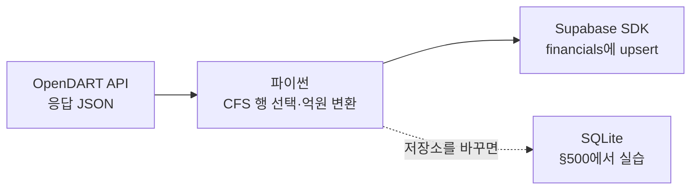

## 📤 OpenDART에서 받은 값을 Supabase로 바로 보내려면?

> [!info] 학습 목표
>
> - OpenDART 응답을 SQLite 중간 파일 없이 Supabase로 바로 적재하는 경로를 이해한다.
> - Supabase Python SDK(`supabase-py`)로 `upsert`·`select`를 호출해본다.
> - API와 SDK의 역할 차이(주소·형식을 직접 조립 vs 준비된 함수 호출)를 설명한다.

[[FD-04-500__load-and-measure|§500]]에서 삼성전자 재무제표를 SQLite에 넣었다. 클라우드에도 같은 값을 보이고 싶을 때 CSV를 따로 만들거나 SQLite를 거쳐 복사할 필요는 없다. OpenDART 응답을 파이썬에서 읽고, 필요한 네 계정을 고른 다음 Supabase Python SDK에 바로 넘기면 된다.

이번 경로는 `OpenDART API → 파이썬 → Supabase`다. [[FD-04-500__load-and-measure|§500]]의 `SQLite` 경로와 저장 위치만 다르다. Supabase 계정·프로젝트·테이블 준비와 자연어 MCP 실습은 [[FD-04-610__supabase-mcp-natural-language|§610]]에서 한다.

> [!info] 실습 순서
> - ① [[FD-04-300__opendart-hard-way|§300]]에서 API 키와 OpenDART 응답을 이해한다.
> - ② [[FD-04-410__mcp-agentic-install|§410]]에서 OpenDART MCP를 준비한다.
> - ③ [[FD-04-610__supabase-mcp-natural-language|§610]]에서 내 Supabase를 만들고 자연어 SQL로 INSERT·SELECT한다.
> - ④ 이 노트와 [[FD-04-900__cloud-supabase-student|§900 노트북]]에서 같은 행을 Python SDK로 upsert·조회한다.
> - 앞 절에서 완료한 단계는 다시 하지 않고, 준비가 안 된 경우에만 해당 절로 돌아간다.

> [!tip] 아직 내 Supabase URL과 키가 없다면
> - §600은 자신의 Supabase 프로젝트가 준비된 뒤 실행한다.
> - 계정·프로젝트 생성과 URL·키 찾기는 먼저 [[FD-04-610__supabase-mcp-natural-language|§610]]을 따라 한다.
> - 아직 준비되지 않았다면 §600 코드를 실행하지 말고, 계정 준비를 마친 뒤 돌아온다.



## 🔑 코드는 남기고, 키는 환경에 둔다

노트북은 FD_26의 `.env`에서 OpenDART 키와 Supabase 접속 정보를 읽는다. 값은 코드나 출력에 쓰지 않는다. Supabase 프로젝트와 `financials` 표를 준비하는 순서는 [[FD-04-610__supabase-mcp-natural-language|§610]]에 있다.

| 환경변수 | 쓰는 곳 |
|---|---|
| `OPENDART_API_KEY` | OpenDART API 응답을 직접 받는다 |
| `SUPABASE_URL` | 내 Supabase 프로젝트에 연결한다 |
| `SUPABASE_PUBLISHABLE_KEY` | 로컬 Python SDK가 내 프로젝트에 읽고 쓴다 |

학생별 Supabase 개인 프로젝트의 publishable key는 로컬 Python 실행에서 쓴다. `financials` 표에는 [[FD-04-610__supabase-mcp-natural-language|§610]]에서 추가하는 RLS(Row Level Security) 정책이 있어, publishable key로 온 요청이라도 그 정책이 허용한 SELECT·INSERT·UPDATE만 할 수 있다. `SUPABASE_SECRET_KEY`는 RLS를 우회하는 백엔드 전용 키라서 이 로컬 코드에는 한 번도 등장하지 않는다 — 노출되면 RLS 정책이 막아주지 못하기 때문이다. 값은 노트북에 붙여 넣거나 출력하지 않고, 저장소에 커밋하지 않는다.

**§600-1**
```python
import os
import requests
from dotenv import load_dotenv
from supabase import create_client

load_dotenv()
OPENDART_KEY = os.getenv("OPENDART_API_KEY")
SUPABASE_URL = os.getenv("SUPABASE_URL")
SUPABASE_PUBLISHABLE_KEY = os.getenv("SUPABASE_PUBLISHABLE_KEY")
if not OPENDART_KEY or not SUPABASE_URL or not SUPABASE_PUBLISHABLE_KEY:
    raise SystemExit("OPENDART_API_KEY, SUPABASE_URL, SUPABASE_PUBLISHABLE_KEY를 FD_26 .env에서 확인한다.")
print("OpenDART와 Supabase 환경변수가 준비됐다.")
# 예상 출력: OpenDART와 Supabase 환경변수가 준비됐다.
```

## 🧾 응답에서 연결 재무제표만 고른다

`fnlttSinglAcnt` 응답에는 여러 계정과 별도·연결 기준이 섞여 있다. `fs_div == "CFS"`로 연결 기준을 고르고, 네 계정을 원 단위에서 억원 단위로 바꾸어 `financials` 행으로 만든다.

**§600-2**
```python
# 📌 §600-2 📡 OpenDART API 응답 받기
params = {"crtfc_key": OPENDART_KEY, "corp_code": "00126380", "bsns_year": "2025", "reprt_code": "11011"}
try:
    response = requests.get("https://opendart.fss.or.kr/api/fnlttSinglAcnt.json", params=params, timeout=10)
    response.raise_for_status()
    data = response.json()
except (requests.RequestException, ValueError):
    raise SystemExit("OpenDART 요청 또는 JSON 해석에 실패했다. 연결·시간 초과라면 이 셀을 한 번 다시 실행하고, 계속되면 §600의 '막혔을 때' 표를 확인한다.") from None
if data.get("status") != "000":
    raise SystemExit(f"OpenDART 응답 오류: status={data.get('status')}, msg={data.get('message')}. §600의 '막혔을 때' 표를 확인한다.")
print("[live]", data["status"], "응답 행 수:", len(data["list"]))
# 예상 출력: [live] 000 응답 행 수: API가 반환한 행 수
```

**§600-3**
```python
# 📌 §600-3 🔎 CFS 네 계정 선택
# 계정 이름을 API 응답의 이름 그대로 사용한다.
targets = {"매출액": None, "영업이익": None, "당기순이익(손실)": None, "자본총계": None}
for row in data["list"]:
    if row["fs_div"] == "CFS" and row["account_nm"] in targets:
        targets[row["account_nm"]] = int(row["thstrm_amount"].replace(",", ""))
if None in targets.values():
    raise SystemExit("필요한 CFS 계정을 찾지 못했다. 응답의 account_nm을 확인한다.")
print(targets)
# 예상 출력: 네 계정의 금액이 원 단위 정수로 표시된다
```

**§600-4**
```python
# 📌 §600-4 🧮 financials 행 만들기
payload = {"code": "005930", "year": 2025}
payload["revenue"] = targets["매출액"] // 100_000_000
payload["operating_profit"] = targets["영업이익"] // 100_000_000
payload["net_income"] = targets["당기순이익(손실)"] // 100_000_000
payload["equity"] = targets["자본총계"] // 100_000_000
print(payload)
# 예상 출력: {'code': '005930', 'year': 2025, 'revenue': 3336059, 'operating_profit': 436010, 'net_income': 452068, 'equity': 4363203}
```

## 🧰 SDK가 뭐예요?

SDK는 **Software Development Kit**, 서비스 회사가 자기 API를 코드에서 쉽게 부르도록 제공하는 개발 도구 모음이다. 이번 수업에서는 `supabase-py`라는 파이썬 라이브러리를 쓴다. API 주소와 요청 내용을 매번 직접 조립하는 대신, 준비된 파이썬 함수로 “이 행을 저장해줘”라고 호출한다.

식당에 비유하면 API는 식당에 주문을 전달하는 창구이고, SDK는 주문을 쉽게 작성해 전달하도록 마련된 주문서와 도구다. SDK가 데이터를 대신 판단하거나 테이블을 자동으로 만들지는 않는다. 우리가 호출할 함수와 저장할 값을 코드로 정하고, SDK가 API 요청 형식으로 전달한다.


자연어 MCP에서는 에이전트에게 표 생성·INSERT·SELECT를 말로 부탁한다. SDK 경로에서는 내가 파이썬 코드의 `create_client`, `table`, `upsert`, `execute`를 호출한다. 두 방식 모두 같은 Supabase API를 사용하지만, MCP는 자연어로 도구를 시키고 SDK는 코드에서 함수를 부른다.

## ☁️ 받은 행을 Supabase에 적재하고 다시 읽는다

이미 같은 종목·연도 행이 있을 수 있으므로 `upsert`를 쓴다. 같은 셀을 다시 실행해도 `PRIMARY KEY (code, year)` 기준으로 행이 늘지 않는다.

**§600-5**
```python
# 📌 §600-5 ☁️ Supabase SDK로 직접 적재
supabase = create_client(os.environ["SUPABASE_URL"], os.environ["SUPABASE_PUBLISHABLE_KEY"])
table = supabase.table("financials")
result = table.upsert(payload, on_conflict="code,year").execute()
print("OpenDART 응답을 Supabase에 적재했다.")
# 예상 출력: OpenDART 응답을 Supabase에 적재했다.
```

**§600-6**
```python
# 📌 §600-6 🔍 Supabase에서 확인
query = supabase.table("financials").select("net_income, equity")
query = query.eq("code", "005930")
query = query.eq("year", 2025)
result = query.execute()
print(result.data)
# 예상 출력: [{'net_income': 452068, 'equity': 4363203}]
```

이제 데이터는 CSV나 SQLite 복사본이 아니라, 실행할 때 OpenDART에서 받은 응답에서 Supabase로 바로 들어간다. 같은 행을 자연어로 테이블에 넣고 SQL을 다뤄보는 경험은 [[FD-04-610__supabase-mcp-natural-language|§610]]에서 이어간다.

---

## 🧯 막혔을 때 비밀값 없이 확인하기

| 보이는 상황 | 확인할 것 | 하지 않을 것 |
|---|---|---|
| 환경변수 준비 셀이 멈춘다 | FD_26 루트에 설정 파일이 있는지, `OPENDART_API_KEY`·`SUPABASE_URL`·`SUPABASE_PUBLISHABLE_KEY`라는 **이름**이 정확한지 확인한다. 값은 화면에 표시하지 않는다. | 키 값 출력·채팅 붙여넣기 |
| OpenDART 요청 실패 | 인터넷 연결, §300에서 확인한 변수 이름, DART 인증키 상태를 확인한다. 응답 상태가 `000`이 아니면 상태 코드와 메시지만 확인한다. | 인증키가 포함될 수 있는 전체 요청 주소 공유 |
| Supabase 연결 또는 적재 실패 | §610의 프로젝트 URL·`financials` 표·RLS 정책이 준비됐는지 확인하고, publishable key가 로컬 설정 파일에만 있는지 본다. | key 값을 출력하거나 오류 화면 캡처 |
| MCP INSERT에서 기본키 중복 오류 | 같은 `(code, year)` 행이 이미 있는지 SELECT한다. 이미 있으면 §600에서 SDK upsert로 확인한다. | 같은 INSERT를 계속 반복하기 |

---

## 🔖 핵심 요약

> [!summary] 🏆 이 노트를 마쳤다면?
>
> - [ ] API 응답의 연결(CFS) 네 계정을 골라 억원 단위로 정리한다.
> - [ ] Python SDK로 OpenDART 응답을 SQLite 중간 파일 없이 Supabase에 적재하고 조회한다.
> - [ ] 키 값은 FD_26 `.env`에서만 읽고 노트북 출력에 남기지 않는다.
