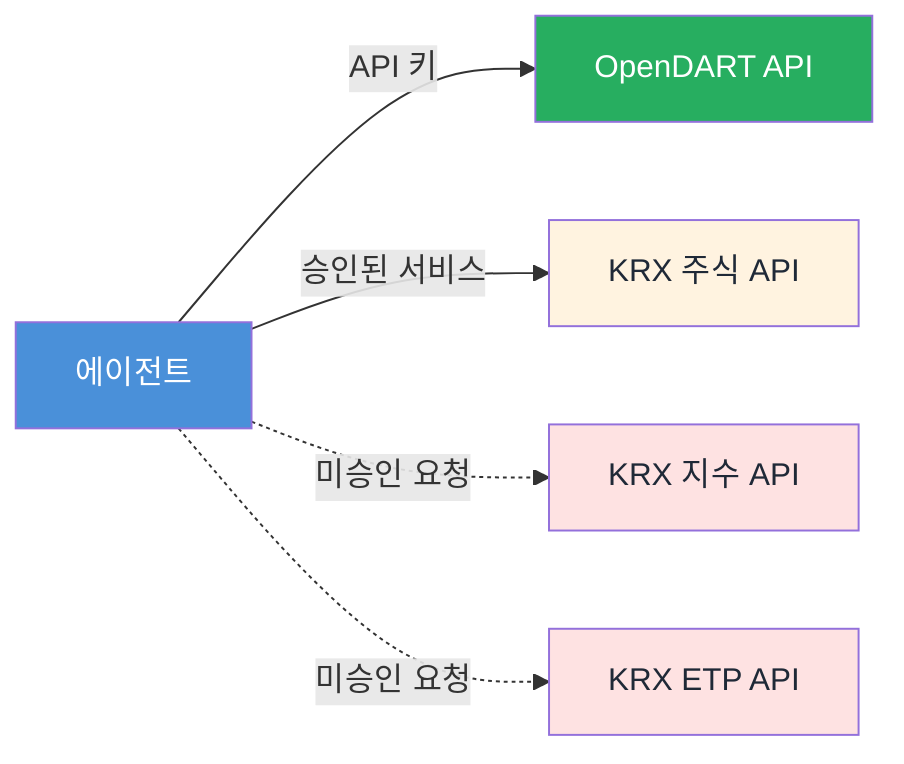

## CLI와 API 권한: 에이전트의 KRX 데이터 접근

> [!info] 학습 목표
>
> - 사람에게는 GUI가, 프로그램·에이전트에게는 CLI(텍스트 입출력)가 왜 더 다루기 쉬운지 설명한다.
> - CLI 명령과 MCP 도구 호출이 데이터를 조회하는 방식을 설명한다.
> - KRX 공식 도구와 커뮤니티 래퍼(krx-cli, openkrx-mcp)를 구분하고, API 승인 거버넌스가 에이전트의 데이터 접근을 어떻게 좌우하는지 설명한다.

---

## 에이전트는 데이터를 어떻게 조회하나

지금까지 우리는 SQL로 가격을 꺼내고, `rolling`·`shift`로 골든크로스를 손수 계산했다. 질문 하나를 던져 본다 — **AI 에이전트에게 같은 것을 시키면, 그 에이전트는 데이터를 어디서 어떻게 가져올까?**

에이전트가 데이터를 조회하려면 프로그램이 호출할 수 있는 인터페이스가 필요하다. CLI는 명령과 결과를 텍스트로 주고받으므로 사람이 화면에서 메뉴를 누르는 방식보다 자동화와 후속 처리에 적합하다.

## GUI와 CLI는 사용 방식이 다르다

같은 요청 — "삼성전자 최근 종가를 보여줘" — 를 두 방식으로 비교해 보자.

| | GUI (사람) | CLI (프로그램·에이전트) |
|---|---|---|
| 방법 | 앱 실행 → 종목 검색 → 차트 탭 클릭 → 기간 설정 → 조회 (클릭 5번) | 터미널 한 줄 |
| 예시 | (화면 조작) | `krx stock search 삼성전자` |
| 출력 | 화면에 그려진 차트 | 표준출력(stdout)에 찍히는 텍스트 또는 JSON |

> [!tip]- krx-cli 명령 출처
> 위 명령은 [krx-cli 공식 저장소](https://github.com/kyo504/krx-cli)의 README에 실제로 있는 명령이다. 이 도구는 종목명으로 검색하는 `krx stock search {종목명}`과, 날짜·시장·코드로 목록을 조회하는 `krx stock list --date {YYYYMMDD} --market kospi --code {ISIN}`을 제공한다 — 종목코드 한 줄로 바로 시세를 찍는 명령은 없다.

사람에게는 GUI가 직관적이지만, 프로그램이나 에이전트에게는 파싱하기 쉬운 텍스트(stdout, JSON)가 훨씬 다루기 쉽다. 유닉스 철학은 오래전부터 "한 가지 일을 잘하는 작은 도구를 파이프로 잇는다"였다 — 도구 하나가 데이터를 꺼내면, 다음 도구가 그것을 받아 가공한다.

*파이프는 이 그림 한 장으로만 다룬다 — 실제 파이프 문법이나 `jq` 같은 도구 실습은 이번 주 하지 않는다.*

Claude Code 같은 코딩 에이전트는 터미널 명령을 직접 실행할 수 있다. 그래서 잘 만들어진 CLI 하나는 곧 에이전트가 쓸 수 있는 도구가 된다 — 사람이 배우는 인터페이스와 에이전트가 쓰는 인터페이스가 같아지는 지점이다.

## CLI와 MCP로 도구 연결하기

Week04에서 다룬 MCP는 에이전트와 외부 도구 사이의 호출 형식을 표준화한다. `openkrx-mcp`를 연결하면 에이전트가 정해진 도구 호출로 KRX 데이터 조회를 요청할 수 있다. 실제 조회 가능 범위는 연결한 서버와 API 권한에 달려 있다.

`krx-cli`는 조금 더 나아가 CLI와 MCP 서버를 함께 제공하는 프로젝트다 — 터미널에서 직접 쓸 수도 있고, 에이전트가 MCP로 붙어 쓸 수도 있다.

> [!warning] 정확히 말해야 할 것
> - **KRX(한국거래소)는 공식 CLI나 공식 MCP 서버를 제공하지 않는다.**
> - `krx-cli`와 `openkrx-mcp`는 모두 개인 개발자가 KRX Open API를 감싸 만든 **오픈소스 커뮤니티 도구**다.
> - 강의에서도, 실제로도 이 둘을 "KRX 공식 도구"라고 부르면 안 된다.

교수가 짧게 시연한다: 터미널에서 삼성전자 최근 가격을 한 줄로 조회한 뒤, 같은 요청을 에이전트에게 자연어로 시켜본다 — "삼성전자 최근 60일로 20/60 골든크로스가 났는지 확인해줘." 학생은 설치하거나 가입하지 않고 화면만 지켜본다.

## KRX API는 서비스별 승인이 필요하다

Week04에서 쓴 OpenDART는 키 하나만 발급받으면 바로 호출할 수 있었다. KRX는 다르다.

| | OpenDART | KRX |
|---|---|---|
| 인증 | API 키 1개, 즉시 발급 | 인증키 승인(영업일 1~3일) |
| 서비스 이용 | 키만 있으면 바로 호출 | **카테고리별**(주식·지수·ETP 등) 서비스 이용을 별도로 신청·승인받아야 함 |
| 미승인 호출 시 | 해당 없음 | `Unauthorized API Call`(에러 코드 6) 즉시 반환 |

데이터 접근을 서비스별로 승인하면 필요한 범위에만 권한을 줄 수 있다. 에이전트가 어떤 데이터를 조회할 수 있는지는 모델의 성능보다 API 키에 승인된 서비스 범위에 달려 있다. KRX 주식 서비스 승인이 없으면 요청은 `Unauthorized API Call`로 거절된다.

이번 실습은 live KRX 호출 대신 저장된 `market_data.db`를 사용한다. 데이터를 데이터베이스에 저장해 두면 API 승인이나 실시간 연결에 의존하지 않고 같은 분석을 반복할 수 있다. Week03에서 다룬 데이터베이스 활용과 같은 방식이다.

> [!tip]- 심화 — KRX 키 승인을 받은 학생이라면
> Week04에서 예고했던 KRX 키 발급을 이미 마친 학생은, 수업 외 선택 탐구로 에이전트에게 다른 종목의 20/60 신호를 실시간으로 확인시키고 `market_data.db` 계산값과 비교해 볼 수 있다. 필수 과제는 아니다.

---

## 확인 문제

> [!tip] 💬 스스로 확인해 보세요
> 1. `krx-cli`나 `openkrx-mcp`를 "KRX 공식 MCP"라고 부르면 안 되는 이유는 무엇인가?
> 2. OpenDART와 KRX의 API 승인 방식이 다른 이유를 "최소 권한 원칙"으로 설명하라.

---

## 🔖 핵심 요약

> [!summary] 🏆 이 노트를 마쳤다면?
>
> - [ ] 에이전트에게 CLI(텍스트 입출력)가 GUI보다 다루기 쉬운 이유를 설명할 수 있다.
> - [ ] CLI 명령과 MCP 도구 호출이 데이터를 조회하는 방식을 설명할 수 있다.
> - [ ] KRX 공식 도구가 없다는 사실과, krx-cli·openkrx-mcp가 커뮤니티 래퍼라는 것을 구분해 말할 수 있다.
> - [ ] OpenDART(키 1개)와 KRX(카테고리별 승인)의 차이를 최소 권한 원칙으로 설명할 수 있다.
> - [ ] 실습에서: 오늘 만든 `market_data.db` 기반 파이프라인이 live API 호출 없이도 같은 분석을 가능하게 한다는 것을 확인한다.
